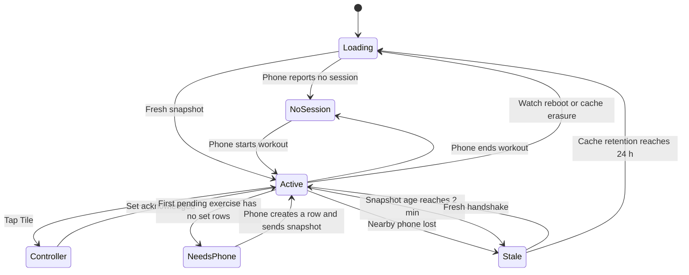

# Wear OS Phase 1 — active-workout Tile and current-set controller

**Status:** specification only — implementation is not authorized by this
document. A separate explicit GO is required after the transport decision and
entry gates below are closed.

- **Decision date:** 2026-09-01
- **Specification base:** `dev` at
  `bbc650ca2acda43d7e0121bb4309d467284a40a1`
- **Delivery lane:** independent Android-only branch and PR to `dev`; never
  stack Wear work on a KMP migration branch.

This specification is authoritative for the first Workeeper watch increment.
It extends [product.md](../product.md) and consumes the already-shipped live
workout behavior in [live-workout.md](live-workout.md). It does not reopen the
phone live-workout design.

## 1. Decision and outcome

Phase 1 is **Tile + one watch screen**:

- the Tile is a glanceable status surface and entry point;
- tapping the Tile opens one minimal Wear OS activity;
- the activity edits the values of the deterministic current set and completes
  that set;
- the Android phone remains the authoritative and only durable workout store;
- the watch stores only an expiring, non-authoritative display cache;
- the implementation is native Android/Wear OS, not KMP and not a precursor to
  shared watch UI.

The outcome is that a user who has already started a workout on the phone can
leave the phone in a pocket, glance at the next set, adjust weight or reps, and
record it from the watch.

## 2. Scope

### 2.1 In scope

- Wear OS only, paired with the Android Workeeper phone app.
- Galaxy Watch Ultra (2024) as the physical acceptance device, plus one small
  round Wear emulator so the UI is not accidentally device-specific.
- Tile states for no active workout, active workout, phone action required,
  disconnected/stale data, and temporary loading/error.
- One activity with:
  - training name and overall exercise progress;
  - current exercise name;
  - current set ordinal;
  - weight controls for weighted exercises;
  - reps controls;
  - one primary `Complete set` action;
  - success/error haptics and explicit in-flight feedback.
- An ongoing activity/notification while the watch controller represents an
  active workout.
- A versioned phone/watch request, response, and command protocol.
- Strict phone-side validation before any write.
- English and Russian resources.
- Light/dark and round-display accessibility verification.

### 2.2 Explicit non-goals

- Starting, finishing, cancelling, deleting, or renaming a session from the
  watch.
- Starting a new exercise, picking another exercise, changing exercise order,
  or editing a plan from the watch.
- Adding/removing set rows, skipping an exercise, changing set type, undoing a
  completed set, or editing an earlier set.
- A rest timer, interval timer, or timer controls. The existing session elapsed
  time may be shown only if it does not require frequent Tile refreshes.
- Heart rate, calories, GPS, steps, motion sensors, automatic rep counting,
  Health Services, Health Connect, or Samsung Health.
- A standalone watch database or standalone workout mode.
- Phone UI redesign or behavior changes unrelated to the bridge.
- watchOS, iPhone pairing, SwiftUI, shared KMP watch presentation, or a common
  watch navigation model.
- Inline mutation controls on the Tile.
- Cloud sync, accounts, telemetry, or workout data in logs/crash metadata.

## 3. User and state flow



The watch never invents an active session. Every active state comes from a
phone response. A cached active state is visibly stale once its freshness
window expires and cannot authorize a write.

### 3.1 Tile contract

| State | Required content | Tap behavior |
| --- | --- | --- |
| No active session | Workeeper + `Start a workout on your phone` | Opens the local instruction screen; it does not remotely start the phone app or a session |
| Active and fresh | Training name, current exercise, set ordinal, compact overall progress | Opens the current-set controller |
| Phone action required | Exercise name plus `Add a set on your phone` | Opens a read-only explanation; it never synthesizes or adds a set |
| Active but stale/disconnected | Last known training/exercise plus `Phone unavailable` | Opens the controller in read-only reconnecting state |
| Loading with no cache | Workeeper + short loading label | Opens the reconnecting screen |
| Retryable transport error | Safe generic error; no payload details | Opens recovery state with explicit retry |
| Protocol mismatch | `Update Workeeper on phone and watch` | Opens a blocked recovery state; no mutation or retry of the incompatible command |

The whole useful Tile container is one large target. The Tile contains no
weight/reps steppers and no completion action. It renders the local cache
immediately and never waits for phone I/O. A refresh request may be launched
after rendering; a later response updates the cache and asks the system to
refresh the Tile.

Tile content is intentionally bounded because Tiles are non-scrollable,
glanceable surfaces. Updates must not be driven once per second. The Tile may
request a refresh on entry, after a command acknowledgement, after a connection
change, and through the platform's normal update budget; no polling loop is
allowed.

### 3.2 Controller contract

The activity has one scrollable screen and no nested navigation. Reading order:

1. connection/status label;
2. training and overall progress;
3. current exercise and `Set X of Y`;
4. weight stepper when the exercise is weighted;
5. reps stepper;
6. primary `Complete set` button.

Every interactive target is at least `48dp × 48dp`, with enough separation that
targets do not overlap. Controls have semantic labels that include the field,
current value, and action. Rotary input may be added only as a second input path;
all actions must remain reachable by touch.

The initial weight and reps exactly mirror the phone snapshot. Reps change in
steps of one. The weight increment is **not guessed in Phase 1**: the entry probe
must first inventory current phone validation and decide one explicit increment
that round-trips through the existing `Double?` model without hidden rounding.
Failure to close this choice before UI implementation is a STOP.

`Complete set` is enabled only when:

- the phone node has completed a fresh handshake;
- the snapshot state is `ActiveWithTarget`, not `PhoneActionRequired`;
- the snapshot carries the current phone-issued mutation lease;
- the snapshot is not stale;
- no command is in flight;
- reps are greater than zero; and
- the target identifiers still describe the current set locally.

Mutation freshness is exactly **two minutes**, measured from the watch's
monotonic receive time for the latest complete `ActiveWorkoutSnapshot`. Node
connectivity, wall-clock changes, retry timers, and non-snapshot traffic do not
refresh this deadline. At `120_000ms` the active state becomes stale even when
the phone node still appears connected, every mutation control is disabled,
and `Complete set` cannot enqueue a command. A complete replacement snapshot
resets the deadline. The foreground controller may issue one
`GetActiveWorkout` request when the deadline expires, and explicit retry may
issue another; neither the controller nor the Tile runs a background polling
loop.

The watch-side deadline prevents enqueue and retry, but it is not write
authorization. Every mutable `ActiveWithTarget` snapshot also carries an opaque
phone-issued mutation lease. The phone creates the lease immediately before it
returns the snapshot and expires it after `120_000ms` on the phone's own
`SystemClock.elapsedRealtime()` clock. Because phone issuance precedes watch
receipt, the phone deadline is never later than the watch's receive-based
deadline; transport latency may cause an earlier authoritative rejection, never
a late write. The phone validates the lease again at serialized transactional
write admission. At the phone boundary, age `119_999ms` is admissible subject to
the other checks, and age `120_000ms` must not write.

All authority-bearing requests (`GetActiveWorkout` and `CompleteCurrentSet`)
pass through one watch-process request sequencer shared by the Tile, activity,
cache, and transport. At issue time it assigns a strictly increasing local
generation and maps it to the wire correlation ID. An explicit retry of the same
in-flight `commandId` retains its original generation; a refresh or corrected
new command receives a new one. The map is bounded to outstanding operations,
and any response whose correlation ID is no longer known is ignored.

Once generation `N` is issued, a response from any lower generation cannot
install a mutation lease or reset the receive-time freshness deadline, even if
it arrives before generation `N` completes. Within the currently admitted
database epoch, a higher session revision may advance read-only display state
and a lower revision is ignored; at the same revision, an older-generation
response is ignored entirely. Only a response for the latest-issued generation
may make that state mutable by installing its lease. Database epochs are opaque,
not sortable: a different epoch is admitted only by the latest correlated
handshake, which retires the previous epoch and all of its pending generations.
An unsolicited snapshot may update read-only display state only when its epoch
matches and its revision is newer; it cannot install a lease or reset mutation
freshness and instead triggers one correlated refresh. This ordering is
process-local; after watch-process restart, an unmatched old response is
ignored.

The UI is pessimistic: it does not advance on tap. It shows in-flight feedback
and waits for a phone acknowledgement issued only after the compare-and-write
transaction commits. The reducer handles outcomes by type rather than treating
every non-success as retryable:

- `Applied` or `AlreadyApplied` clears the draft and in-flight command, replaces
  the screen from the returned snapshot, and produces a confirmation haptic.
- A transport timeout, lost acknowledgement, or explicitly retryable temporary
  transport failure keeps the edits and the same `commandId`, produces an error
  haptic, and offers explicit retry. Retry is allowed only while the originating
  snapshot remains fresh and the local target is unchanged; otherwise the watch
  requests a replacement snapshot instead of resending the command.
- `StaleRevision`, `TargetChanged`, `AuthorizationExpired`, or
  `NoActiveSession` is authoritative. The watch clears the obsolete draft and
  in-flight command, immediately applies the returned replacement snapshot or
  no-session state, and never retries the old command.
- A value-validation rejection keeps the editable draft and identifies the
  invalid field, but the corrected submission receives a new `commandId`.
- A protocol/version rejection clears the in-flight command, disables mutation,
  and enters the update-required state; it cannot retry the incompatible
  payload.

## 4. Canonical current-set rule

Phase 1 does not synchronize the phone screen's ephemeral expanded-card or focus
state. `LiveWorkoutStore.activeExerciseUuids`, draft text, and keyboard focus are
presentation state and are not durable truth.

The phone bridge derives the watch target from persisted rows with the same
load-time inputs as `ExerciseDoneRule`, without inventing the live screen's draft
or row-count override:

1. order performed exercises by `position` and ignore skipped exercises;
2. for each exercise, build expected positions from the union of plan indices
   and persisted performed-set positions;
3. if that union is non-empty, choose its first position without a persisted
   completed set; the first exercise with such a position is the watch current
   exercise;
4. if the first non-skipped, not-done exercise has an empty union, stop traversal
   and return `PhoneActionRequired(NoSetRows, performedExerciseUuid)`. The Tile
   and controller show `Add a set on your phone`, remain read-only, and request a
   fresh snapshot after the phone creates a row. The bridge must not synthesize
   fallback position `0` and must not skip ahead to a later exercise; and
5. return `WorkoutComplete` only when every non-skipped exercise with an expected
   position is complete and no `PhoneActionRequired` exercise exists.

This deliberately means out-of-order exercise selection on the phone is not
mirrored in Phase 1. It is safer than persisting a new pointer or treating an
ephemeral UI selection as session truth. Shared behavior-vector tests must run
the phone Live-workout completion rule and the bridge rule over the same planned,
performed, skipped, empty, and sparse-position fixtures. The empty/no-plan/no-row
fixture must produce `PhoneActionRequired`, not `WorkoutComplete` or a synthetic
target. A mismatch is a STOP.

Drafts typed on the phone but not checked are not synchronized. This preserves
the existing explicit persistence contract: only a completed set is durable.

## 5. Ownership and consistency

### 5.1 Source of truth

- The phone Room database is authoritative.
- The watch never writes a workout database and never declares success before a
  phone acknowledgement.
- Watch storage contains only the last protocol snapshot, its
  `receivedAtElapsedRealtimeMs`, the corresponding `Settings.Global.BOOT_COUNT`,
  and minimal connection metadata in app-private storage.
- A no-session response erases the active cache immediately.
- The two-minute mutation deadline is independent of display-cache retention:
  stale content may remain visible and read-only while mutation is disabled.
- Display-cache retention is a **maximum**, not a minimum: within one boot, age
  is measured from `SystemClock.elapsedRealtime()`, including deep sleep, and
  the payload is erased before rendering at age `86_400_000ms`.
- A process restart in the same boot reuses the persisted elapsed-realtime
  baseline and therefore cannot restart either deadline. If the persisted boot
  count differs from the current boot count, either value is missing/corrupt,
  or the elapsed-realtime baseline is otherwise impossible, the watch erases
  the payload before rendering and returns to cacheless loading. Early erasure
  after reboot is intentional; cached workout details never survive a reboot.
- Wall-clock time is neither persisted for retention nor consulted when deciding
  freshness or erasure, so setting the clock forward or backward cannot extend
  cache life.
- The Wear application opts out of Android backup/data extraction for this
  cache.

### 5.2 Command validation

Every completion command carries at least:

- `schemaVersion`;
- `commandId`;
- `sessionUuid`;
- `performedExerciseUuid`;
- `setPosition`;
- the opaque snapshot version `(databaseEpoch, sessionRevision)` it was edited
  from;
- the opaque phone-issued `mutationLeaseId`; and
- `weight`, `reps`, and immutable set type copied from the snapshot.

The phone keeps mutation leases only in process memory, with one bounded active
slot per source watch node/session/version. A lease contains a cryptographically
random ID, source node ID, session UUID, database epoch/revision, the snapshot's
target identities/position, and `expiresAtPhoneElapsedRealtimeMs`. It is
reused for every concurrent or duplicate snapshot response for that exact slot
while unexpired; issuing another response for the same version/target cannot
rotate or replace it. The serialized phone coordinator creates a successor only
after expiry or a version/target transition, invalidates the old slot on a
snapshot-authorizing mutation or session transition, and loses all slots on
phone-process restart. A lease is never reconstructed from wall-clock time or
accepted from a different node, session, epoch, revision, or target. An absent,
mismatched, retired, or expired lease returns `AuthorizationExpired` plus a
replacement snapshot; it cannot mutate. A newly returned mutable snapshot
contains the current lease for its exact slot.

A content hash is not a concurrency token. Phase 1 requires a tested Room
migration that adds durable synchronization metadata owned by the phone
database:

- a non-repeating opaque database epoch generated during migration/new-database
  creation and rotated before a restored/replaced database is admitted to
  listeners;
- a per-session `Long` revision initialized once and incremented monotonically
  in the same transaction as every snapshot-authorizing mutation; and
- one bounded last-applied Wear receipt slot per session containing `commandId`,
  a deterministic request fingerprint, and the resulting version. The
  fingerprint covers the authenticated source node ID, schema version, source
  database epoch/revision, target identities/position, mutation lease ID,
  submitted values, and immutable set type; transport correlation metadata is
  excluded.

Snapshot-authorizing mutations include set insert/update/delete,
mark-done/uncheck, undo compensation, skip/unskip, performed-exercise
add/remove/reorder, session transitions, every plan attach/detach/content write,
and every exercise-type or weight-clearing cascade that can change an active
session's canonical target, submitted defaults, or validation. The inventory
must include both live entry points (`LiveWorkoutInteractorImpl.setPlanForExercise`
and `setAdhocPlan`), the underlying `TrainingExerciseRepository.setPlan` and
`ExerciseRepository.setAdhocPlan` paths, training-plan attach/detach, and
`ExerciseRepository.setExerciseType`, `saveItem`, and
`clearWeightsFromAllPlansForExercise` when their type/plan effects reach an
active session.

For a plan or exercise mutation that affects multiple active sessions, the
coordinator resolves every affected session and increments each revision in the
same database transaction as the plan/type/cascade write. It clears each prior
Wear receipt and retires each affected process-memory lease after commit. Plan
length changes must invalidate a moved target, while value/type changes at the
same position must invalidate stale submitted defaults even when the target
identity is unchanged. A split write-then-revision sequence is forbidden.

The revision never decrements or returns to an earlier value during one database
epoch. Phone process restart preserves it. A non-Wear mutation clears the last
Wear receipt while incrementing the revision. Backup restore/recovery rotates
the database epoch and clears the receipt before listener admission, so a
command from the retired generation cannot match a restored older counter.
Wall-clock time and a hash of current rows may be carried for diagnostics but
can never authorize a write.

The current `SetRepositoryImpl.upsert` is not an acceptable command boundary:
it performs a lookup followed by an insert, while the
`(performed_exercise_uuid, position)` index is non-unique. Phase 1 must add one
phone-side mutation coordinator whose database bodies run through the existing
`DbTransitionRunner` `immediateTransaction`. Every snapshot-authorizing
application writer listed above must enter this serialized transition seam and
bump the session revision. Set-row writers must additionally use one atomic
row-write primitive rather than call the current lookup/insert sequence
independently.

Serialization does not make every operation share the Wear target policy. The
coordinator exposes operation-specific validation while preserving existing
phone behavior:

- `CompleteCurrentSet` validates the submitted row against the canonical watch
  target, source version, and mutation lease;
- phone mark-done validates the row selected by the current phone flow;
- editing an already-completed phone row validates that exact existing
  `(performedExerciseUuid, position)` row, even after the canonical watch target
  advanced; and
- phone uncheck/delete, skip, reorder, and session operations retain their
  existing domain validation;
- plan attach/detach/write and exercise-type/weight-clear operations retain
  their existing domain rules while atomically bumping every affected active
  session revision.

Every successful phone-side mutation increments the same revision for each
affected active session and clears its prior Wear receipt in the transaction.
Sharing the Wear current-target check with completed-row edits or plan-editor
writes is forbidden because it would regress the shipped phone flow.

Inside the `CompleteCurrentSet` transaction specifically, the gateway must:

1. reject a database-epoch mismatch before inspecting the target;
2. re-read the active session and verify that the submitted exercise belongs to
   it and is not skipped;
3. compare `commandId` and request fingerprint with the durable receipt. An exact
   match returns `AlreadyApplied` only when the receipt's resulting version is
   also the current database epoch/revision; reuse of one ID for another
   fingerprint is a protocol rejection. This receipt-only outcome performs no
   mutation and therefore may be returned after the original lease expired;
4. require exact equality with the durable session revision. Any mismatch is
   `StaleRevision` even when current rows hash to the same content;
5. require the process-bound mutation lease to match the source node, session,
   database epoch/revision, and submitted target, then read the phone
   monotonic clock at write admission. At `expiresAt` or later, return
   `AuthorizationExpired` without a row write, revision bump, or new receipt;
6. re-derive the canonical target and inspect any existing row for
   `(performedExerciseUuid, position)`. A moved target or differing row returns
   an authoritative conflict; otherwise validate values and perform exactly one
   insert/update;
7. increment the session revision, persist the Wear receipt, and derive the
   complete replacement snapshot data from the same serialized database state;
   and
8. return from the transaction before any acknowledgement is emitted, so a
   rollback or failed commit can never be reported as success.

After commit, the serialized coordinator retires the old process-memory lease,
issues a lease bound to the committed version when the replacement state is
mutable, attaches it to the response snapshot, and only then acknowledges. A
lease is never published from a transaction that later rolls back; the old
lease's version binding already prevents reuse after the committed revision
advance.

`commandId` correlates request, retry, and response. After a lost acknowledgement
or phone-process restart, only the exact durable receipt can produce
`AlreadyApplied`; state equality alone cannot. Any later phone or watch mutation
increments the revision and invalidates the older request, including an ABA
sequence that completes and then unchecks/deletes the same set. Concurrent
deliveries may choose different candidate UUIDs before admission, but only the
transaction winner may create the row, and every later writer must observe and
reuse or reject that row. The invariant is at most one persisted row per
`(performedExerciseUuid, position)`.

The revision/receipt migration is required, not optional. If any relevant writer
can bypass the shared immediate-transaction gateway, or the concurrency oracle
can produce two rows, implementation must additionally add a unique database
constraint with a data-preserving migration. Existing duplicate target rows
must never be silently discarded; discovering them without an owner-approved
reconciliation rule is a STOP.

The response echoes `commandId` and returns a typed semantic outcome together
with the complete replacement snapshot or no-session state. A transport timeout
has no response and remains distinct from a phone rejection. Free-form exception
messages and stack traces never cross the device boundary.

### 5.3 Races

- If the set was completed on the phone first, the watch command is rejected as
  stale, receives the newer snapshot, discards its obsolete draft, and does not
  retry the old command.
- If the phone finishes/cancels the session, the watch clears to no-session.
- If connection drops before acknowledgement, the watch does not claim success;
  retry of the same command is safe only while its source snapshot remains fresh.
- If a command was enqueued while locally fresh but reaches transactional write
  admission at or after the phone lease deadline, it returns
  `AuthorizationExpired` and cannot write. An exact replay of an already
  committed receipt may still return `AlreadyApplied` because no second write
  occurs.
- Concurrent phone/watch completions and duplicate Wear deliveries are
  serialized by the shared immediate transaction. The loser observes the
  winner's row and returns `AlreadyApplied` or authoritative stale; exactly one
  final row exists for the target.
- If the phone completes and then unchecks/deletes the target, both mutations
  advance the durable revision. A delayed command from the original snapshot is
  rejected as stale even though the visible rows returned to their earlier
  shape.
- If the phone process restarts, a request rebuilds a fresh snapshot; the watch
  cache never becomes authoritative.
- Phone-side reads/writes from the listener must acquire the repository's
  generation-bound DB-work admission at first operation and release it in
  `finally`. The listener must not retain an `AppGraph` or repository across a
  backup restore/recovery generation swap. The existing backup-specific lease
  seam must be generalized or paralleled with a typed Wear seam before the
  listener touches the database.

## 6. Transport and privacy gate

This section is blocking, not advisory.

Workeeper currently promises that data does not leave the device and that there
is no cloud sync. Wear OS Data Layer is the supported phone/watch communication
API, but Android's documentation states that Data Layer clients can route data
through Google-owned servers when Bluetooth is unavailable. The payload is
end-to-end encrypted, but relay transit still conflicts with a strict
device-local promise.

`Node.isNearby` means a direct Bluetooth connection is possible; it is not, by
itself, documented as a per-message transport lock. Therefore an implementation
must not present `isNearby` filtering as proof that a payload could never use a
network relay.

Before production payload code, the owner must explicitly choose one of these
policies:

| Policy | Result |
| --- | --- |
| Preserve strict local-only guarantee | Implementation remains stopped unless a supported API can guarantee direct local transport for each workout payload |
| Permit end-to-end encrypted Data Layer relay | Amend `product.md` and user-facing privacy copy first; use the smallest non-persistent protocol and document that Google relay transit can occur |

Until that decision, only a payload-free capability/connectivity probe is
authorized by a future implementation GO. No workout name, exercise name, UUID,
set, weight, reps, or timing data may be sent during the probe.

If relay is explicitly accepted later, prefer `MessageClient` request/response
semantics over `DataClient`: messages are non-persistent and have no automatic
retry, while data items persist and may be backed up. The application must add
its own acknowledgement and safe retry semantics described above. Phone and
watch artifacts must use matching application IDs and signatures.

## 7. Android-only module boundary

Target topology for implementation:

```text
core/wear-protocol       Kotlin/JVM wire models + codec; no UI and no KMP target
feature/wear-bridge      Android phone listener, snapshot builder, validation
app/wear                 Wear OS application, Tile, activity, cache, transport
```

Constraints:

- `app/wear` uses Wear Compose/Material and Tiles ProtoLayout directly. It does
  not depend on `app/common`, phone navigation, `core/ui/kit`, or a shared KMP UI
  module.
- `feature/wear-bridge` may consume the Android target of existing data modules,
  but must not move Wear concepts into `commonMain`.
- `core/wear-protocol` is shared only between the two Android artifacts. A
  future watchOS protocol may be designed independently.
- A Room migration for the durable database epoch, per-session revision, and
  bounded Wear receipt is required. It must follow the repository migration
  recipe and prove upgrade, rollback-on-failure, export/restore behavior, and
  unchanged workout rows. A unique target constraint is additionally required
  only if the serialized-writer invariant cannot be proven.
- The watch application needs a narrow application convention without Firebase,
  Google Services JSON, Crashlytics, performance monitoring, or KSP.
- `app/wear` emits dev/store variants whose application IDs and signing keys
  exactly match the corresponding phone APK (`.dev` for development and the
  base package for store release). It declares the watch hardware feature and
  uses the repository SDK/version catalog.

The implementation entry probe must prove the final Gradle variant names,
paired-install package/signature equality, and that root `assembleDebug`,
`assembleDebugAndroidTest`, `lintDebug`, and `testDebugUnitTest` still discover
the intended Wear tasks. Failure is a STOP; do not weaken repository gates.

## 8. Lifecycle and ongoing surface

An active workout represented on the watch is a long-running experience. The
watch app must expose the platform ongoing-activity/notification affordance so
the user can return in one tap. It does not imply sensor tracking or a second
workout engine.

- Start it only after a fresh active-session response.
- Update it from cached snapshots, not a per-second loop.
- Deep-link it to the same controller activity.
- When the connection is lost, retain read-only status during the bounded
  reconnect window, then stop the ongoing surface and leave the stale Tile.
- Stop immediately on a no-session response.
- Never hold a wake lock solely to keep the Tile or controller fresh.

The exact reconnect window is fixed at implementation entry after measuring the
platform reconnect behavior on the target physical watch; it must be at least
the documented four-minute reconnection interval plus a small deterministic
margin, and must have a testable constant rather than an unbounded timer.

## 9. Protocol surface

The initial protocol has three logical operations:

| Operation | Direction | Purpose |
| --- | --- | --- |
| `GetActiveWorkout` | Watch → phone | Request the current authoritative snapshot |
| `ActiveWorkoutSnapshot` | Phone → watch | Replace cached state, including no-session |
| `CompleteCurrentSet` | Watch → phone | Atomically compare-and-write the exact current set; return a typed outcome plus replacement snapshot |

`ActiveWorkoutSnapshot` has four mutually exclusive payload states:
`NoSession`, `ActiveWithTarget`, `PhoneActionRequired`, and `WorkoutComplete`.
Only `ActiveWithTarget` carries a mutable target. `PhoneActionRequired` carries
a typed reason and the relevant exercise identity for display, never a fallback
set position. A mutable snapshot also carries its opaque mutation lease ID; no
other state does.

All envelopes carry `schemaVersion` and a correlation ID. Unknown versions and
unknown operations fail closed. Payloads are bounded well below the Data Layer
message limit, use one deterministic `kotlinx.serialization` representation,
and have round-trip tests with committed fixtures. Protocol fields are domain
values, not localized strings, except display names that the watch must render.

Correlation IDs are also the wire key for the watch's local request-generation
map; they are not sufficient by themselves to order responses. The reducer
consults the locally assigned generation plus the durable snapshot version
before applying any authority-bearing response. Tile and activity must not own
independent request counters or lease-bearing caches.

There is no silent compatibility fallback. A newer incompatible peer shows an
update-required state and disables mutation.

## 10. Accessibility and product writing

- Minimum touch target: `48dp × 48dp`.
- Do not rely on color or haptics alone for success, failure, connection, or
  disabled state.
- Dynamic values use tabular numerals where available and remain legible with
  system font scaling.
- Long training/exercise names truncate predictably without hiding set controls.
- English and Russian strings use the repository localization conventions; no
  user-facing string is assembled from English fragments.
- Weightless exercises omit weight controls entirely.
- `Complete set` is the single visually dominant action.
- Destructive session actions do not appear anywhere on the watch.

## 11. Test contract

### 11.1 Host tests

- Protocol round trips, unknown-version rejection, size bound, and committed
  fixture compatibility.
- Watch state reducer for every Tile/controller state, including fake-clock
  proofs that a connected-but-silent snapshot is fresh at `119_999ms`, stale at
  `120_000ms`, and cacheless after reboot; connection changes, in-flight
  behavior, acknowledgement, retryable transport failure, stale/target/no-session
  convergence, validation correction, and protocol mismatch.
- Shared request-sequencer/reducer oracles for overlapping refreshes: after
  generation 2 is issued, a same-version generation-1 response cannot apply
  either before or after generation 2's response; concurrent same-slot responses
  reuse the identical unexpired lease; after a legitimate lease rotation, `L2`
  followed by late `L1` retains `L2`; lower durable revisions are ignored; an
  older-generation higher revision may only advance read-only state;
  unsolicited snapshots remain read-only until a correlated refresh;
  same-command retries retain their generation; unknown/expired correlation IDs
  are ignored; and Tile/activity observe the same sequence and cache.
- Current-target derivation for planned, ad-hoc, skipped, complete, empty,
  sparse-position, weighted, and weightless sessions. An empty no-plan/no-row
  exercise before a populated later exercise returns
  `PhoneActionRequired(NoSetRows)` and never position `0` or the later target.
- Shared behavior-vector parity against the phone Live-workout done rule.
- Phone command validation for wrong session, wrong exercise, stale revision,
  stale position, invalid values, duplicate retry, write failure, and success.
- Phone-monotonic lease oracles proving first delivery accepted at `119_999ms`,
  rejected without mutation at `120_000ms`, an enqueue-before/arrival-after
  delay, wrong-node/session/version lease rejection, same-slot lease reuse,
  retired-successor invalidation, process-restart invalidation, and expired
  exact-receipt replay returning `AlreadyApplied` without a second write.
- Version oracles proving strictly increasing revisions across every listed
  phone/watch snapshot-authorizing mutation, persistence across process restart,
  database-epoch rotation on restore, exact-receipt replay after lost
  acknowledgement, command-ID/fingerprint mismatch rejection, and
  complete → uncheck/delete → delayed-old-command rejection despite identical
  current content.
- Phone-flow regression oracles proving an already-completed set-0 type/value
  edit still succeeds after the canonical watch target advances to set 1,
  increments the revision, clears the Wear receipt, and makes an older watch
  command stale. That phone edit must not run the Wear current-target guard.
- Writer-inventory and real-database oracles covering live/training/ad-hoc plan
  writes, plan attach/detach, exercise type changes through both narrow and
  `saveItem` paths, and weight-clearing cascades. Plan length changes move the
  target and bump every affected active-session revision; same-position
  weight/reps/type changes also bump it and invalidate all affected leases even
  when the target tuple is unchanged.
- Real-database concurrency oracles for simultaneous delivery of the same
  command, different commands for the same target, phone/watch completion, and
  phone-process retry after a lost acknowledgement. Every case asserts one row,
  one transaction winner, a deterministic typed loser result, and a snapshot
  whose revision matches the committed state.
- Cache tests proving `86_399_999ms` retained and `86_400_000ms` erased, plus
  same-boot process restart, changed boot count, missing/corrupt metadata,
  impossible elapsed baseline, wall-clock movement in both directions, erasure
  before first render, and backup exclusion configuration.
- DB-work lease tests proving a listener cannot touch a retired generation and
  releases admission on success, failure, timeout, and cancellation.
- Tile layout tests proving one launch target and no mutation action.
- Accessibility semantics for every control and disabled/error state.

### 11.2 Device tests

- Paired physical Galaxy Watch Ultra + Android phone: install identity,
  capability discovery, request/response, complete set, haptics, phone DB result,
  Tile refresh, ongoing return affordance, disconnect/reconnect, phone-process
  death, and session finish on phone.
- Small round Wear emulator: clipped text, scroll reachability, `48dp` targets,
  font scaling, English/Russian, light/dark, weighted/weightless.
- Race: complete the same set on phone and watch; exactly one final row exists and
  the watch converges to the phone snapshot.
- Backup restore/recovery while a watch request waits or runs; no old-generation
  read/write survives.
- Empty no-plan/no-row exercise: Tile and controller require phone action, expose
  no completion control, and converge after a set is created on the phone.
- With the controller open, edit the active plan length/values and change the
  exercise type on the phone; the old watch command cannot write and the watch
  converges to the newly authorized snapshot without regressing the phone edit.

Device evidence must identify the APK package/signature pair, OS/API versions,
and exact test scenario. Manual observation without the resulting phone DB
assertion is not completion evidence.

### 11.3 Repository gates

Run the full `AGENTS.md` gates for the final implementation diff, including:

- `assembleDebug`;
- `assembleDebugAndroidTest`;
- `verifyPaparazziDebug`;
- `:lint-rules:test`;
- `detekt`;
- the personal-data gate;
- `lintDebug`; and
- `testDebugUnitTest`.

Add focused Wear assemble, lint, unit, and instrumented-APK tasks once the exact
variant names are proven. A watch UI change also requires fresh rendered evidence
for the target round sizes; do not approve it from phone previews.

## 12. Parallel delivery with KMP migration

The streams are conceptually independent but share repository integration files.

- The specification PR changes only this new file and `product.md`.
- Wear implementation starts from the latest `dev` on its own branch, never from
  a KMP PR head.
- Watch UI and wire protocol remain Android/JVM-only and can be developed without
  modifying current KMP source sets.
- Plan-editor KMP integration PR #273 has landed in `dev` at merge commit
  `bbc650ca2acda43d7e0121bb4309d467284a40a1`; broader KMP migration continues.
  The phone bridge must extend that post-#273 `AppGraph` and `app/common` shape,
  then rebase onto the latest `dev` immediately before changing the graph or
  listener integration files.
- Any conflict is resolved by preserving the KMP architecture first and adding a
  narrow Android extension; never copy the pre-migration graph shape back.
- The Wear PR targets `dev`, remains separately reviewable, and cannot merge
  until the KMP-required contexts and Wear gates are green at the same final
  head.

## 13. Implementation increments after GO

1. **Entry probes:** package/signature variants, payload-free Data Layer
   capability probe, current-set parity fixtures, Gradle task discovery, and a
   complete inventory of set, plan, plan-attachment, exercise-type/cascade, and
   session writers, migration baseline, and duplicate-target probe.
2. **Protocol/cache:** versioned models, codec, watch cache, reducer, and tests.
3. **Watch read-only surface:** Tile, controller states, accessibility, and
   rendered evidence against fake transport.
4. **Phone bridge:** migration, durable epoch/revision/receipt, process-bound
   mutation leases, generation-safe snapshot reads, and the serialized mutation
   coordinator with operation-specific phone/Wear validation, rebased onto the
   latest `dev` and extending the post-#273 graph contract.
5. **Paired integration:** acknowledgement, Tile refresh, ongoing activity,
   disconnect/race handling, and physical-device proof.
6. **Final review:** full repository gates, signed commits, zero unresolved
   review threads, and an independent Codex review pass before handoff.

Each increment must remain buildable and reviewable. The privacy policy decision
must close before increment 2 sends any workout payload.

## 14. STOP conditions

Stop and return to the owner if any of the following occurs:

- no supported transport can meet the selected privacy policy;
- implementation would silently permit Google relay transit under the current
  strict product promise;
- phone and watch package names or signing certificates do not match;
- current-set behavior diverges from the persisted phone Live-workout rule;
- the revision/receipt migration cannot preserve existing workout data or rotate
  the database epoch safely across restore;
- the phone cannot reject a first-delivery command at the mutation-lease expiry
  boundary inside serialized write admission;
- a snapshot-authorizing writer would bypass the shared transaction/revision
  bump;
- a plan/type/cascade writer can affect an active snapshot without atomically
  bumping every affected session revision and retiring its lease;
- the coordinator would make an existing completed-row phone edit depend on the
  canonical watch target;
- Tile and activity cannot share one request-generation/cache authority or an
  older correlated response can reinstall a replaced lease;
- duplicate target rows exist without an owner-approved reconciliation rule;
- a listener would access repositories without generation-bound admission;
- KMP/common source sets, shared watch UI, Health APIs, or sensor permissions
  become necessary;
- the Tile needs frequent polling or direct mutation controls to feel usable;
- root CI no longer discovers or validates the new modules;
- physical-device evidence cannot prove the resulting phone database state; or
- the branch is not rebased on the latest `dev` before touching overlapping KMP
  graph integration files.

## 15. Exit criteria

Phase 1 is complete only when:

- all defined Tile states and the single controller screen match this contract;
- a paired watch can update and complete the authoritative current phone set;
- stale/disconnected/protocol-mismatch states cannot mutate data;
- typed retry/stale handling and the atomic phone/watch write boundary converge
  without duplicate rows, obsolete-draft retries, or false success;
- an in-flight first delivery cannot mutate at or after its phone-side lease
  deadline, while an exact already-applied receipt remains safely idempotent;
- existing phone edits of completed rows remain valid after the watch target
  advances and still invalidate older watch commands;
- plan length/value/type and exercise-type cascades invalidate every affected
  session revision/lease, and out-of-order responses cannot restore retired
  authority;
- empty exercises require phone action without creating a fallback row, and the
  durable version rejects ABA commands after complete/uncheck or restore;
- package/signature, lifecycle, cache erasure, accessibility, localization, and
  ongoing-activity requirements are proven;
- the chosen transport policy is reflected consistently in product/privacy copy;
- no Health, sensor, watchOS, or KMP watch scope entered the diff;
- all focused, repository, and paired-device gates are green at the final head;
- commits are signed and GitHub-verified; and
- the PR is handed to the owner for merge and is not merged by the implementer.

## 16. Platform references

- [Tiles overview and principles](https://developer.android.com/training/wearables/tiles)
- [Tile interactions](https://developer.android.com/training/wearables/tiles/interactions)
- [Ongoing activities](https://developer.android.com/training/wearables/notifications/ongoing-activity)
- [Wear Data Layer overview and transport behavior](https://developer.android.com/training/wearables/data/overview)
- [Reachable and nearby nodes](https://developer.android.com/training/wearables/data/discover-devices)
- [Data Layer client types](https://developer.android.com/training/wearables/data/client-types)
- [Android monotonic clocks](https://developer.android.com/reference/android/os/SystemClock)
- [Android boot count](https://developer.android.com/reference/android/provider/Settings.Global#BOOT_COUNT)
