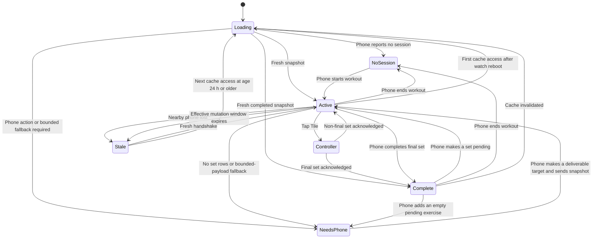

# Wear OS Phase 1 — active-workout Tile and current-set controller

**Status:** specification only — implementation is not authorized by this
document. A separate explicit GO is required after the transport decision and
entry gates below are closed.

- **Decision date:** 2026-09-01
- **Specification base:** `dev` at
  `bbc650ca2acda43d7e0121bb4309d467284a40a1`
- **Delivery lane:** independent Android-only branch and PR to `dev`; never
  stack Wear work on a KMP migration branch.

This specification is authoritative for the first Workeeper watch increment.
It extends [product.md](../product.md) and consumes the already-shipped live
workout behavior in [live-workout.md](live-workout.md). It does not reopen the
phone live-workout design.

## 1. Decision and outcome

Phase 1 is **Tile + one watch screen**:

- the Tile is a glanceable status surface and entry point;
- tapping the Tile opens one minimal Wear OS activity;
- the activity edits the values of the deterministic current set and completes
  that set;
- the Android phone remains the authoritative and only durable workout store;
- the watch stores only an expiring, non-authoritative display cache;
- the implementation is native Android/Wear OS, not KMP and not a precursor to
  shared watch UI.

The outcome is that a user who has already started a workout on the phone can
leave the phone in a pocket, glance at the next set, adjust weight or reps, and
record it from the watch.

## 2. Scope

### 2.1 In scope

- Wear OS only, paired with the Android Workeeper phone app.
- Galaxy Watch Ultra (2024) as the physical acceptance device, plus one small
  round Wear emulator so the UI is not accidentally device-specific.
- Tile states for no active workout, active workout, phone action required,
  disconnected/stale data, and temporary loading/error.
- One activity with:
  - training name and overall exercise progress;
  - current exercise name;
  - current set ordinal;
  - weight controls for weighted exercises;
  - reps controls;
  - one primary `Complete set` action;
  - success/error haptics and explicit in-flight feedback.
- An ongoing activity/notification while the watch controller represents an
  active workout.
- A versioned phone/watch request, response, and command protocol.
- Strict phone-side validation before any write.
- English and Russian resources.
- Light/dark and round-display accessibility verification.

### 2.2 Explicit non-goals

- Starting, finishing, cancelling, deleting, or renaming a session from the
  watch.
- Starting a new exercise, picking another exercise, changing exercise order,
  or editing a plan from the watch.
- Adding/removing set rows, skipping an exercise, changing set type, undoing a
  completed set, or editing an earlier set.
- A rest timer, interval timer, or timer controls. The existing session elapsed
  time may be shown only if it does not require frequent Tile refreshes.
- Heart rate, calories, GPS, steps, motion sensors, automatic rep counting,
  Health Services, Health Connect, or Samsung Health.
- A standalone watch database or standalone workout mode.
- Phone UI redesign or behavior changes unrelated to the bridge.
- watchOS, iPhone pairing, SwiftUI, shared KMP watch presentation, or a common
  watch navigation model.
- Inline mutation controls on the Tile.
- Cloud sync, accounts, telemetry, or workout data in logs/crash metadata.

## 3. User and state flow



The watch never invents an active session. Every active state comes from a
phone response. A cached active state is visibly stale once its freshness
window expires and cannot authorize a write.

`Active` in the diagram means that a canonical target can be displayed, not
that a write is necessarily authorized. Only a fresh
`ActiveWithTarget/MutationAuthority.Granted` substate is actionable.
`MutationAuthority.Unavailable` keeps the target visible but read-only and
immediately requests a correlated handshake.

### 3.1 Tile contract

| State | Required content | Tap behavior |
| --- | --- | --- |
| No active session | Workeeper + `Start a workout on your phone` | Opens the local instruction screen; it does not remotely start the phone app or a session |
| Active and fresh | Training name, current exercise, set ordinal, compact overall progress | Opens the current-set controller |
| Phone action required — no set rows | Bounded exercise name, or localized generic `Exercise`, plus `Add a set on your phone` | Opens a read-only explanation; it never synthesizes or adds a set |
| Phone action required — unsupported values | Bounded exercise name, or localized generic `Exercise`, plus `Edit the current set on your phone` | Opens a read-only explanation; it never rounds, clamps, or sends the unsupported values |
| Snapshot too large for watch | Localized generic workout label plus `Open this workout on your phone` | Opens a read-only explanation; no remote name, target, or mutation lease is present |
| Workout complete | Training name plus localized `Workout complete` and `Finish on your phone` | Opens the read-only completion screen; it cannot finish the session |
| Active but stale/disconnected/authority unavailable | Last known training/exercise plus reason-appropriate `Phone unavailable` or `Refresh required` | Opens the controller in read-only reconnecting state; it never exposes a rejected draft on the Tile |
| Loading with no cache | Workeeper + short loading label | Opens the reconnecting screen |
| Retryable transport error | Safe generic error; no payload details | Opens recovery state with explicit retry |
| Protocol mismatch | `Update Workeeper on phone and watch` | Opens a blocked recovery state; no mutation or retry of the incompatible command |

The whole useful Tile container is one large target. The Tile contains no
weight/reps steppers and no completion action. It renders the local cache
immediately and never waits for phone I/O. A refresh request may be launched
after rendering; a later response updates the cache and asks the system to
refresh the Tile.

Tile content is intentionally bounded because Tiles are non-scrollable,
glanceable surfaces. Updates must not be driven once per second. The Tile may
request a refresh on entry, after a command acknowledgement, after a connection
change, and through the platform's normal update budget; no polling loop is
allowed.

### 3.2 Controller contract

The activity has one scrollable screen and no nested navigation. Reading order:

1. connection/status label;
2. training and overall progress;
3. current exercise and `Set X of Y`;
4. weight stepper when the exercise is weighted;
5. reps stepper;
6. primary `Complete set` button.

For an accepted `WorkoutComplete` snapshot, the controller replaces the set
controls with a read-only confirmation: bounded training name, localized
`Workout complete`, and `Finish on your phone`. It exposes no exercise target,
weight/reps values, completion action, or mutation lease. A later accepted
`ActiveWithTarget` or `PhoneActionRequired` snapshot replaces this presentation;
an accepted `NoSession` moves to the no-session instruction. The watch never
retains the final target as a completion fallback and cannot finish the session.

`PhoneActionRequired` is reason-specific. `NoSetRows` shows `Add a set on your
phone`; `UnsupportedNumericValues` shows `Edit the current set on your phone`.
Both use the bounded exercise name or localized generic `Exercise`, expose no
editable values or completion action, and carry no mutation lease.

`ActiveWithTarget` plus `MutationAuthority.Unavailable` instead renders the
canonical stored target/values with all mutation controls disabled and a
localized `Refresh required` status. When it accompanies a known validation
outcome, the controller may overlay the retained local draft and its one-shot
field error; the Tile and durable snapshot/cache contain only canonical stored
values, never that rejected draft.

Every interactive target is at least `48dp × 48dp`, with enough separation that
targets do not overlap. Controls have semantic labels that include the field,
current value, and action. Rotary input may be added only as a second input path;
all actions must remain reachable by touch.

The initial weight and reps exactly mirror an admitted phone snapshot. Reps
change in steps of one. The weight increment is **not guessed in Phase 1**: the
entry probe must select one positive integer increment in hundredths of a
kilogram and prove its exact conversion to the existing `Double?` persistence
model without hidden rounding. The same decision fixes null → value behavior and
the enabled state at zero/maximum; controls never wrap, overflow, or silently
clamp. Reps may be edited down to the unfilled value zero, but no completion can
send it; increment is disabled at `999`. Failure to close the weight-step/null
choice before UI implementation is a STOP.

`Complete set` is enabled only when:

- the phone node has completed a fresh handshake;
- the snapshot state is `ActiveWithTarget`, not `PhoneActionRequired`;
- its explicit mutation-authority variant is `Granted` and carries the complete
  current phone-issued lease tuple/window, not `Unavailable`;
- the snapshot is not stale;
- no command is in flight;
- the editable draft satisfies the exact Phase 1 numeric domain in §5.2; and
- the target identifiers still describe the current set locally.

The base mutation-freshness window is exactly **two minutes**, but the accepted
per-snapshot window for `MutationAuthority.Granted` is conservatively shortened
to the phone lease that actually remains. `MutationAuthority.Unavailable`
carries no lease remainder, derives no effective window, and is read-only even
when its target/version is current. For each correlated request the shared
sequencer records
`requestedAtWatchElapsedRealtimeMs`. When its response arrives, it computes:

```text
requestRttMs = receivedAtWatchElapsedRealtimeMs - requestedAtWatchElapsedRealtimeMs
safeLeaseRemainingMs = max(0, leaseRemainingAtPhoneSendMs - requestRttMs)
effectiveMutationWindowMs = min(120_000, safeLeaseRemainingMs)
```

Subtracting the whole request round trip is intentionally conservative because
the response leg is no longer than that round trip. For a `Granted` response the
watch persists `effectiveMutationWindowMs` atomically with the snapshot and
measures its deadline from `receivedAtWatchElapsedRealtimeMs`; for an
`Unavailable` response the persisted field is `null`. At the granted deadline
the active state becomes stale even when the phone node still appears connected,
every mutation control is disabled, and `Complete set` cannot enqueue a command. A
zero, negative, malformed, or out-of-range lease remainder never grants mutation
authority. Node connectivity, wall-clock changes, retry timers, and non-snapshot
traffic do not refresh the window.

A complete latest-generation replacement snapshot may start a new derived
window. The foreground controller may issue one `GetActiveWorkout` request when
the window expires, and explicit retry may issue another; neither the controller
nor the Tile runs a background polling loop.

The watch-side deadline prevents enqueue and retry, but it is not write
authorization. Every mutable `ActiveWithTarget` snapshot also carries an opaque
phone-issued mutation lease. For every distinct authority-bearing request that
returns a mutable snapshot, the phone creates an ordered successor immediately
before dispatch, expires it after `120_000ms` on the phone's own
`SystemClock.elapsedRealtime()` clock, and includes
`leaseRemainingAtPhoneSendMs` sampled at response handoff. Only an exact
duplicate delivery of the same correlation ID may replay the same serialized
response/lease; another handshake cannot reuse it. The conservative watch
calculation above therefore never leaves controls enabled past the known lower
bound of phone authority. The phone validates the lease again at serialized
transactional write admission. At the phone boundary, age `119_999ms` is
admissible subject to the other checks, and age `120_000ms` must not write; a
command sent near the watch deadline can still receive authoritative expiry if
its own delivery crosses that boundary.

All authority-bearing requests (`GetActiveWorkout` and `CompleteCurrentSet`)
pass through one watch-process request sequencer shared by the Tile, activity,
cache, and transport. At issue time it assigns a strictly increasing local
generation and maps it, its watch-monotonic issue time, and operation identity to
the wire correlation ID. The sequencer owns one explicit local authority state:

- `Available(leaseId, leaseGeneration, target, effectiveDeadline)` authorizes a
  new command;
- issuing attempt 1 of `CompleteCurrentSet` atomically moves that exact lease to
  `AttemptBound(commandId, attemptFingerprint, leaseId, leaseGeneration,
  target, effectiveDeadline)` and makes every mutation control read-only. The
  command's own generation does **not** retire this delivery-only binding, which
  cannot authorize a different command; and
- `Retired` authorizes neither first delivery nor retry.

Any later authority-bearing request other than the one allowed retry of that
same logical command immediately moves `Available` or `AttemptBound` to
`Retired`; otherwise the phone could publish a successor while the watch still
presents the old lease as usable. The allowed retry retains the command's local
generation and exact attempt-bound lease/fingerprint while receiving its second
attempt correlation. A refresh or corrected new command receives a new
generation. The map is bounded to outstanding operations, and any response whose
correlation ID is no longer known is ignored. One logical command owns at most
two attempt correlations: the initial delivery and one explicit retry. Both
remain known until a terminal outcome or source snapshot invalidation; a second
transport ambiguity abandons that command and forces a correlated refresh before
a new command may be created.

Reaching the attempt's unchanged effective deadline or invalidating the source
tuple also moves `Available` or `AttemptBound` to `Retired`, without making a
still-known late response ineligible for once-only outcome reduction. Any
recognized command response retires its original attempt binding before the
attached snapshot is considered. A terminal response may then install
`Available` only through the ordinary latest-generation snapshot gate. An
explicitly retryable response may instead atomically replace the retired binding
with the accepted same-intent successor `AttemptBound` defined below. No other
response can restore that delivery binding.

An admitted `ActiveWithTarget` whose mutation-authority variant is `Unavailable`
may replace the displayed canonical target/values, but it atomically leaves the
local authority state `Retired`. At the same database epoch/session/revision, a
lower-generation unavailable payload cannot demote or overwrite a newer admitted
snapshot; a higher-revision payload still follows the ordinary read-only version
advance rule. The correlated command outcome remains independently eligible for
once-only reduction.

Once generation `N` is issued, a response from any lower generation cannot
install a mutation lease or reset the receive-time freshness deadline, even if
it arrives before generation `N` completes. The reducer admits one authority
domain `(databaseEpoch, activeIdentity)`, where `activeIdentity` is either
`Session(sessionUuid)` or the `NoSession` tombstone. Per-session revisions are
never compared across different active identities. Only a response for the
latest-issued local generation may introduce another session identity or apply
`NoSession`; doing so retires the previous session's lease, draft, pending
attempts, and freshness.

Within the currently admitted database epoch and the same `Session` identity, a
higher session revision may advance read-only display state and a lower revision
is ignored; at the same revision, an older-generation `Granted` response with an
equal or lower durable lease generation is ignored entirely, while an
`Unavailable` response is admitted only at the latest-issued local generation.
A lower-generation response
whose session identity differs from the admitted identity, or whose
`NoSession`/session state would cross that boundary, is ignored for snapshot
state regardless of its numeric revision. The separately correlated command
outcome remains eligible for once-only reduction below.

For duplicate `Granted` responses of one local generation, the greater durable
lease generation wins and an older one cannot reinstall retired authority. An
exact-correlation replay must remain byte-identical, so a `Granted`/`Unavailable`
shape change for one correlation is a protocol failure. Only a response for the
latest-issued local generation may make that state mutable by installing its
lease. Database epochs are opaque, not sortable: a different
epoch is admitted only by the latest correlated handshake, which retires the
previous epoch and all of its pending generations. An unsolicited snapshot may
update read-only display state only when its epoch and `Session` identity match
the admitted domain and its session or lease generation is newer. It cannot
introduce another session, apply `NoSession`, install a lease, or reset mutation
freshness and instead triggers one correlated refresh. This local request
ordering is process-local; after watch-process restart, an unmatched old
response is ignored, while durable lease generations still order responses
created by different phone processes.

Response ordering gates the attached snapshot, not the semantic outcome of a
known command. A `CompleteCurrentSet` response is reduced in two independent
phases:

1. when its correlation ID and `commandId` still identify the pending command,
   consume the typed outcome once for that delivery attempt. A terminal outcome
   marks the logical command terminal; an explicitly retryable temporary outcome
   moves it to `AwaitingRetryAuthority`, not directly to resendable. Duplicate
   outcomes for one attempt have no reducer effect; then
2. pass the attached replacement snapshot through the epoch, active-identity,
   workout-revision, lease-generation, and local request-generation gates above.

For a typed retryable outcome, only an accepted mutable replacement with the
same database epoch/revision and target may complete the transition: the logical
command retains its `commandId`, submitted values, and local generation, but is
rebound to the accepted successor lease ID/generation and receives a new attempt
correlation. Its attempt fingerprint is recomputed because the lease binding is
part of that fingerprint. The retryable phone path performs no workout mutation
and persists no Wear receipt, so this pre-commit rebind cannot collide with an
applied receipt. If the attached snapshot is rejected by any authority gate, is
read-only, or changes version/target, the old logical command cannot resend; the
draft may remain for the user, but the watch requests a fresh snapshot and any
later submission receives a new `commandId`.

An older-generation response can therefore clear an in-flight command, retain a
validation draft, identify an invalid field, or produce the appropriate haptic
without reinstalling its older lease or resetting freshness. If the semantic
outcome requires authoritative convergence but its snapshot is rejected, the
controller keeps the already-newer display when available, remains read-only,
and issues one latest-generation correlated refresh. Unknown, expired, or
already-consumed attempt correlations affect neither outcome state nor snapshot
authority.

The UI is pessimistic: it does not advance on tap. It shows in-flight feedback
and waits for a phone acknowledgement issued only after the compare-and-write
transaction commits. The reducer handles outcomes by type rather than treating
every non-success as retryable:

- `Applied` or `AlreadyApplied` clears the draft and in-flight command and
  produces a confirmation haptic. Its snapshot replaces the screen only if the
  independent authority gate accepts it; otherwise the newer current display is
  preserved.
- A transport timeout or lost acknowledgement delivers no accepted response or
  successor lease to the watch. It keeps the edits, `commandId`, submitted
  values, and original attempt-bound lease/fingerprint, and produces an error
  haptic. Retry is allowed only while that originating effective window remains
  fresh, the local target is unchanged, no authority generation newer than
  attempt 1 has been issued, and the current authority state is the exact
  matching `AttemptBound(commandId, attemptFingerprint, leaseId,
  leaseGeneration)`. If a refresh, local expiry, abandonment, recognized
  response, or other successor intervenes, the original binding becomes
  `Retired` and cannot be used for the timeout resend. Only an accepted typed
  retryable response may install its distinct successor-bound attempt state; all
  other still-compatible drafts require a new `commandId` and attempt fingerprint
  under later accepted authority. A lost response may already have rotated an
  unseen phone-side successor, so the one resend may safely converge through
  `AuthorizationExpired`; it is not assumed to succeed. Only one resend is
  allowed for the logical command; another ambiguity forces refresh.
- An explicitly retryable typed response produces an error haptic and follows
  the successor-rebind transition above. Retry is offered only after that
  transition succeeds; it never resends the retired original lease.
- `StaleRevision`, `TargetChanged`, or `NoActiveSession` is authoritative. The
  watch clears the obsolete draft and in-flight command, never retries the old
  command, and applies the returned replacement/no-session state only if its
  snapshot passes the authority gate; otherwise it stays read-only and refreshes
  as described above.
- `AuthorizationExpired` is terminal for the old command but does not by itself
  prove the edits obsolete. If its accepted replacement has the exact source
  database epoch, session, revision, and canonical target, preserve the draft.
  A mutable replacement allows explicit submission under its successor lease
  with a new `commandId`; a replacement encoded as
  `MutationAuthority.Unavailable(FreshHandshakeRequired)`, or a `Granted`
  replacement whose derived effective lease window is zero, parks the same draft
  read-only and refreshes. A rejected attached snapshot also parks
  the draft only while the already-displayed state still matches that complete
  source tuple. Any later compatible mutable snapshot still requires a new
  command. Clear the draft only when an accepted/current authoritative state
  changes the database epoch, session, revision, or canonical target, removes
  the target, or applies `NoSession`.
- A value-validation rejection identifies the invalid field. It keeps the
  editable draft only while the current display still matches the command's
  source workout version and target; otherwise it discards the obsolete draft,
  preserves the field-specific error as a one-shot event, and refreshes. The
  rejection performs no row write, receipt, revision bump, or successor-lease
  issue. Its accepted same-source replacement is the canonical stored
  `ActiveWithTarget` plus
  `MutationAuthority.Unavailable(FreshHandshakeRequired)`: it contains the
  stored target/values, never the rejected draft, and contains no lease fields or
  effective window. Any corrected submission first obtains fresh `Granted`
  authority and receives a new `commandId`.
- `ImmutableTypeMismatch(ExerciseType | SetType)` is a terminal authoritative
  command-metadata conflict, not a user-editable value error. It clears the draft
  and in-flight command, uses the generic localized `Refresh required` recovery
  status, and never emits a field-validation error. Its accepted
  replacement is the canonical stored `ActiveWithTarget` plus
  `MutationAuthority.Unavailable(FreshHandshakeRequired)`; a fresh `Granted`
  handshake and new `commandId` are required before any later submission.
- A protocol/version rejection clears the in-flight command, disables mutation,
  and enters the update-required state; it cannot retry the incompatible
  payload.

## 4. Canonical current-set rule

Phase 1 does not synchronize the phone screen's ephemeral expanded-card or focus
state. `LiveWorkoutStore.activeExerciseUuids`, draft text, and keyboard focus are
presentation state and are not durable truth.

The phone bridge derives the watch target from persisted rows with the same
load-time inputs as `ExerciseDoneRule`, without inventing the live screen's draft
or row-count override:

1. order performed exercises by `position` and ignore skipped exercises;
2. for each exercise, build expected positions from the union of plan indices
   and persisted performed-set positions;
3. if that union is non-empty, choose its first position without a persisted
   completed set; the first exercise with such a position is the watch current
   exercise;
4. if the first non-skipped, not-done exercise has an empty union, stop traversal
   and return `PhoneActionRequired(NoSetRows, performedExerciseUuid,
   boundedExerciseDisplayName)`. The Tile and controller show `Add a set on your
   phone`, remain read-only, and request a fresh snapshot after the phone creates
   a row. The bridge must not synthesize fallback position `0` and must not skip
   ahead to a later exercise;
5. before authorizing a selected target, convert its persisted/default reps and
   effective exercise-type weight through the exact §5.2 snapshot domain. A
   failed conversion returns
   `PhoneActionRequired(UnsupportedNumericValues(field),
   performedExerciseUuid, boundedExerciseDisplayName)` with no target, values,
   or lease; and
6. return `WorkoutComplete` only when every non-skipped exercise with an expected
   position is complete and no `PhoneActionRequired` exercise exists.

This deliberately means out-of-order exercise selection on the phone is not
mirrored in Phase 1. It is safer than persisting a new pointer or treating an
ephemeral UI selection as session truth. Shared behavior-vector tests must run
the phone Live-workout completion rule and the bridge rule over the same planned,
performed, skipped, empty, and sparse-position fixtures. The empty/no-plan/no-row
fixture must produce `PhoneActionRequired`, not `WorkoutComplete` or a synthetic
target. Numeric-domain fixtures must likewise stop on the selected unsupported
exercise rather than skip to a later valid target. A mismatch is a STOP.

Drafts typed on the phone but not checked are not synchronized. This preserves
the existing explicit persistence contract: only a completed set is durable.

## 5. Ownership and consistency

### 5.1 Source of truth

- The phone Room database is authoritative.
- The watch never writes a workout database and never declares success before a
  phone acknowledgement.
- Watch storage contains one versioned, atomically published app-private cache
  record. Its bounded framing header contains the cache schema version,
  `receivedAtElapsedRealtimeMs`, corresponding `Settings.Global.BOOT_COUNT`,
  nullable derived `effectiveMutationWindowMs`, nullable
  `ongoingStopAtElapsedRealtimeMs`, payload length, and payload digest; the same
  atomic record contains the raw last protocol snapshot and minimal connection
  metadata. The ongoing deadline is present only while an actionable ongoing
  surface is eligible and is shortened atomically on an earlier disconnect.
  None of those fields may be committed in separate preference keys or files.
- Cache replacement uses `AtomicFile` semantics or an equivalent temp-write,
  durable-sync, atomic-publish primitive. In-memory publication occurs only
  after the complete durable record is published. A failed, cancelled, or
  process-killed replacement exposes either the complete previous record or the
  complete new record, never a mixed snapshot/clock pair. A corrupt, truncated,
  oversized, or digest-mismatched record is treated as absent and deletion is
  attempted.
- The shared reader parses only the bounded framing header and validates its
  length/digest and boot/TTL metadata before decoding the workout payload. Tile,
  activity, and ongoing surfaces cannot bypass that reader.
- An accepted no-session response atomically replaces any active record with a
  payload-free `NoSession` tombstone before the reducer exposes that state;
  physical deletion may follow. Once accepted, a process death cannot reveal the
  superseded active payload on the next read.
- The per-snapshot effective mutation deadline (capped at two minutes) is
  independent of display-cache retention: stale content may remain visible and
  read-only while mutation is disabled.
- Display-cache retention is a strict **access-time TTL**, not a promise that the
  OS will wake an idle process for physical deletion. Within one boot, age is
  measured from `SystemClock.elapsedRealtime()`, including deep sleep. At age
  `86_400_000ms`, every cache read treats the payload as absent and attempts to
  delete it before protocol-payload decode or render. Deletion failure cannot
  expose the expired payload: the read still returns cacheless loading and
  retries cleanup on a later access.
- A process restart in the same boot reuses the persisted elapsed-realtime
  baseline and therefore cannot restart either deadline. If the persisted boot
  count differs from the current boot count, either value is missing/corrupt,
  or the elapsed-realtime baseline is otherwise impossible, the first cache read
  returns cacheless loading and attempts deletion before decode/render. Cached
  workout details are never readable after reboot even if physical bytes remain
  until the app is next scheduled.
- A cache read never installs mutation authority. After every watch-process
  start, an otherwise valid same-boot cached session is display-only and triggers
  a correlated handshake; the persisted effective window proves that deadlines
  were not extended and drives stale/lifecycle state, but only that live latest-
  generation response may install its lease.
- The framing header is also the restart boundary for the ongoing surface. If
  `ongoingStopAtElapsedRealtimeMs` is present and already reached, the reader
  cancels that notification before protocol-payload decode. If it is still in
  the future, an already-posted system notification keeps its original timeout;
  process restart never recreates a missing notification from display-only
  cache. Any in-process update to the surviving notification uses only the
  remaining interval, never the original full interval. A process restart,
  reconnect callback, or ordinary cache read cannot move the persisted deadline
  later; only a newly accepted fresh `ActiveWithTarget` snapshot carrying
  `MutationAuthority.Granted` may replace it. An unavailable target snapshot
  persists no effective window or ongoing deadline.
- If no watch process runs at the deadline, app-private cache bytes may
  remain physically present past 24 hours. No exact alarm, WorkManager deadline,
  wake lock, or background loop is claimed solely for deletion; the security and
  product guarantee is non-access after the TTL, enforced by the single cache
  read boundary used by Tile, activity, and ongoing surface.
- Wall-clock time is neither persisted for retention nor consulted when deciding
  freshness or erasure, so setting the clock forward or backward cannot extend
  cache life.
- The Wear application opts out of Android backup/data extraction for this
  cache.

### 5.2 Command validation

Every completion command carries at least:

- `schemaVersion`;
- `commandId`;
- `sessionUuid`;
- `performedExerciseUuid`;
- `setPosition`;
- the opaque snapshot version `(databaseEpoch, sessionRevision)` it was edited
  from;
- the phone-issued `mutationLeaseId` and durable `mutationLeaseGeneration`; and
- `weightHundredthsKg`, `reps`, and immutable exercise/set type copied from the
  snapshot.

Phase 1 deliberately defines a narrower **watch-write** domain than the shipped
phone editor. It does not add a global phone-data cap:

| Field | Accepted command value | Typed rejection |
| --- | --- | --- |
| `reps: Int` | `1..999` inclusive | `InvalidValues(Reps, BelowMinimum | AboveMaximum)` |
| `weightHundredthsKg: Int?` for a weighted exercise | `null` or `0..99_999` inclusive (`0.00..999.99 kg`) | `InvalidValues(Weight, BelowMinimum | AboveMaximum)` |
| `weightHundredthsKg` for a weightless exercise | exactly `null` | `InvalidValues(Weight, MustBeNullForWeightless)` |

The copied immutable metadata is validated separately from editable values.
Both the exercise type and set type must exactly equal the canonical target read
inside the serialized transaction. A mismatch returns the typed terminal outcome
`ImmutableTypeMismatch(ExerciseType | SetType)`, never `InvalidValues`; it has no
user-editable field error and follows the read-only replacement/recovery rule in
§3.2. Validation order is deterministic: if both copied types differ,
`ExerciseType` is reported first. This outcome is reachable only after the
source epoch/revision, lease, canonical target, and stored-value representability
checks pass. If the serialized re-read instead yields `NoSession`,
`WorkoutComplete`, or `PhoneActionRequired`, the earlier authoritative outcome
and canonical non-target replacement win; `ImmutableTypeMismatch` is not emitted.

The caps are Phase 1 watch-UX limits: at most three rep digits and one bounded
fixed-point weight. Both boundary labels must be proven on the target round sizes.
They do not reject or rewrite phone-only editing/history; an out-of-domain
current target takes the read-only phone-action path below.

`reps` and `weightHundredthsKg` are signed 32-bit integers on the wire so every
accepted value has one canonical encoding. A floating-point token, fractional
reps, integer overflow, `NaN`, or positive/negative infinity is not a value to
clamp: the codec rejects the envelope as
`ProtocolRejected(InvalidNumericEncoding)` before command admission. The stable
intent and attempt fingerprints hash the canonical integers/null, never a
formatted label or raw `Double` bits.

The snapshot builder uses the same fixed-point representation. A weighted phone
`Double?` is admitted only when it is `null`, or when it is finite, non-negative,
not negative zero, at most `999.99`, and converts exactly to hundredths without
rounding. On the Android/JVM phone bridge the required conversion oracle is
`BigDecimal.valueOf(weight).movePointRight(2).intValueExact()` followed by the
range check and `hundredths.toDouble() / 100.0 == weight`; failure at any step is
unsupported rather than rounded. The raw IEEE-754 sign bit rejects negative zero
before `BigDecimal` conversion.
Snapshot reps may be `0..999` because zero is the editable unfilled state, but a
completion command still requires `1..999`. A weightless snapshot always emits
`null` regardless of an irrelevant legacy residual weight; it never exposes or
copies that residue into a new row.

If the current weighted value cannot make that exact conversion, or snapshot
reps lie outside `0..999`, the phone returns read-only
`PhoneActionRequired(UnsupportedNumericValues(field))` with the exercise
identity and bounded display name. It includes no offending value, target,
position, or mutation lease and performs no normalization or database write.
The user fixes the stored value through the existing phone flow. Thus a legacy
phone row remains readable on the phone, while Phase 1 never transports or
persists an unround-trippable value from the watch.

The phone keeps mutation leases only in process memory, with one bounded active
slot per source watch node/session/version. A lease contains a cryptographically
random ID, source node ID, session UUID, database epoch/revision, the snapshot's
target identities/position, durable lease generation, optional retry-intent
binding, and `expiresAtPhoneElapsedRealtimeMs`. The serialized phone
coordinator creates a successor for every distinct authority-bearing correlation
that returns a mutable snapshot and atomically increments the session's durable
lease generation before publishing it. Concurrent same-version handshakes
therefore receive ordered `L1`, `L2`, ... successors; publishing each retires
the previous slot. Only an exact duplicate delivery of the same correlation may
replay its already-serialized response while that response remains available in
the bounded request-deduplication map. A snapshot-authorizing mutation or session
transition also retires the old slot, and phone-process restart loses all
in-memory slots, so the first successor from the new process increments the
durable generation. A lease is never reconstructed from wall-clock time or
accepted from a different node, session, epoch, revision, generation, or target.
An absent, mismatched, retired, or expired lease returns
`AuthorizationExpired` plus a replacement snapshot; it cannot mutate. A newly
returned mutable snapshot contains the current lease ID/generation and bounded
remaining lifetime for its exact slot.

The protocol derives two deterministic hashes for a command. Its stable intent
fingerprint covers source node, schema, source epoch/revision, target, submitted
values, and immutable exercise and set types but excludes lease and correlation.
Its attempt fingerprint additionally covers the lease ID/generation and is the
fingerprint stored in a durable applied receipt. A successor issued with an
explicitly retryable outcome is process-memory-bound to that command's
`commandId` and stable intent fingerprint. This binding is the only pre-receipt
case in which the same `commandId` may arrive with a different attempt
fingerprint; the gateway requires the successor lease and unchanged intent.
Phone-process restart loses both lease and retry binding, so the watch must
refresh rather than invent a rebind.

A content hash is not a concurrency token. Phase 1 requires a tested Room
migration that adds durable synchronization metadata owned by the phone
database:

- a non-repeating opaque database epoch generated during migration/new-database
  creation and rotated before a restored/replaced database is admitted to
  listeners;
- a per-session `Long` revision initialized once and incremented monotonically
  in the same transaction as every snapshot-authorizing mutation;
- a per-session `Long` lease generation initialized once and incremented in a
  serialized database transaction whenever a distinct authority-bearing request
  creates an in-memory lease successor; exact replay of the same correlation and
  serialized response does not increment it; and
- one bounded last-applied Wear receipt slot per session containing `commandId`,
  a deterministic request fingerprint, and the resulting version. The
  fingerprint covers the authenticated source node ID, schema version, source
  database epoch/revision, target identities/position, mutation lease
  ID/generation, submitted values, and immutable exercise and set types;
  transport correlation metadata is excluded.

Snapshot-authorizing mutations include set insert/update/delete,
mark-done/uncheck, undo compensation, skip/unskip, performed-exercise
add/remove/reorder, session transitions, every plan attach/detach/content write,
and every exercise-type or weight-clearing cascade that can change an active
session's canonical target, submitted defaults, or validation. The inventory
must include both live entry points (`LiveWorkoutInteractorImpl.setPlanForExercise`
and `setAdhocPlan`), the underlying `TrainingExerciseRepository.setPlan` and
`ExerciseRepository.setAdhocPlan` paths, training-plan attach/detach, and
`ExerciseRepository.setExerciseType`, `saveItem`, and
`clearWeightsFromAllPlansForExercise` when their type/plan effects reach an
active session.

For a plan or exercise mutation that affects multiple active sessions, the
coordinator resolves every affected session and increments each revision in the
same database transaction as the plan/type/cascade write. It clears each prior
Wear receipt and retires each affected process-memory lease after commit. Plan
length changes must invalidate a moved target, while value/type changes at the
same position must invalidate stale submitted defaults even when the target
identity is unchanged. A split write-then-revision sequence is forbidden.

The revision never decrements or returns to an earlier value during one database
epoch. Phone process restart preserves it. A non-Wear mutation clears the last
Wear receipt while incrementing the revision. Backup restore/recovery rotates
the database epoch and clears the receipt before listener admission, so a
command from the retired generation cannot match a restored older counter.
Wall-clock time and a hash of current rows may be carried for diagnostics but
can never authorize a write.

The current `SetRepositoryImpl.upsert` is not an acceptable command boundary:
it performs a lookup followed by an insert, while the
`(performed_exercise_uuid, position)` index is non-unique. Phase 1 must add one
phone-side mutation coordinator whose database bodies run through the existing
`DbTransitionRunner` `immediateTransaction`. Every snapshot-authorizing
application writer listed above must enter this serialized transition seam and
bump the session revision. Set-row writers must additionally use one atomic
row-write primitive rather than call the current lookup/insert sequence
independently.

Serialization does not make every operation share the Wear target policy. The
coordinator exposes operation-specific validation while preserving existing
phone behavior:

- `CompleteCurrentSet` validates the submitted row against the canonical watch
  target, source version, and mutation lease;
- phone mark-done validates the row selected by the current phone flow;
- editing an already-completed phone row validates that exact existing
  `(performedExerciseUuid, position)` row, even after the canonical watch target
  advanced; and
- phone uncheck/delete, skip, reorder, and session operations retain their
  existing domain validation;
- plan attach/detach/write and exercise-type/weight-clear operations retain
  their existing domain rules while atomically bumping every affected active
  session revision.

Every successful phone-side mutation increments the same revision for each
affected active session and clears its prior Wear receipt in the transaction.
Sharing the Wear current-target check with completed-row edits or plan-editor
writes is forbidden because it would regress the shipped phone flow.

Inside the `CompleteCurrentSet` transaction specifically, the gateway must:

1. reject a database-epoch mismatch before inspecting the target;
2. re-read the active session and verify that the submitted exercise belongs to
   it and is not skipped;
3. compare `commandId` and request fingerprint with the durable receipt. An exact
   match returns `AlreadyApplied` only when the receipt's resulting version is
   also the current database epoch/revision; once a receipt exists, reuse of one
   ID for another attempt fingerprint is a protocol rejection. Before a receipt
   exists, a changed attempt fingerprint is accepted only through the matching
   retry-bound successor described above. This receipt-only outcome performs no
   mutation and therefore may be returned after the original lease expired;
4. require exact equality with the durable session revision. Any mismatch is
   `StaleRevision` even when current rows hash to the same content;
5. require the process-bound mutation lease to match the source node, session,
   database epoch/revision, durable lease generation, and submitted target, then
   read the phone monotonic clock at write admission. At `expiresAt` or later,
   return `AuthorizationExpired` without a row write, revision bump, or new
   receipt;
6. re-derive the canonical target and inspect any existing row for
   `(performedExerciseUuid, position)`. A moved target or differing row returns
   an authoritative conflict. A canonical non-target state returns its typed
   authoritative replacement before command metadata is inspected. Otherwise
   require both copied immutable types to equal the canonical types; a mismatch
   returns `ImmutableTypeMismatch(ExerciseType | SetType)`. Only after both match,
   validate `reps` and `weightHundredthsKg` against the table in §5.2; an invalid
   editable value returns the field/reason-specific `InvalidValues`. Either
   rejection performs no row write, receipt, revision bump, or successor lease.
   From that same serialized read it derives the current canonical target and
   stored values as
   `ActiveWithTarget` with
   `MutationAuthority.Unavailable(FreshHandshakeRequired)`; the replacement
   contains neither the rejected draft nor any lease ID, lease generation,
   remaining lifetime, or effective window. Only a valid fixed-point weight is
   converted to `Double` without rounding immediately before exactly one
   insert/update;
7. increment the session revision, persist the Wear receipt, and derive the
   complete replacement snapshot data from the same serialized database state;
   and
8. return from the transaction before any acknowledgement is emitted, so a
   rollback or failed commit can never be reported as success.

Before any recognized terminal or retryable command response leaves the
serialized coordinator, it retires the presented process-memory lease. For a
successful mutation this happens only after the database commit; for a
non-mutating value/type rejection it happens after the serialized canonical
read/outcome construction. Only a replacement encoded with
`MutationAuthority.Granted` is mutable and eligible to atomically increment the
durable lease generation, issue a lease bound to the committed/current version,
attach both to the response snapshot, and only then acknowledge.
`MutationAuthority.Unavailable` never enters lease issuance. Lease-generation
allocation is serialized with all other issuance for the session. A lease is
never published from a transaction that later rolls back; the old lease's
version binding already prevents reuse after the committed revision advance.

`commandId` correlates request, retry, and response. After a lost acknowledgement
or phone-process restart, only the exact durable receipt can produce
`AlreadyApplied`; state equality alone cannot. Any later phone or watch mutation
increments the revision and invalidates the older request, including an ABA
sequence that completes and then unchecks/deletes the same set. Concurrent
deliveries may choose different candidate UUIDs before admission, but only the
transaction winner may create the row, and every later writer must observe and
reuse or reject that row. The invariant is at most one persisted row per
`(performedExerciseUuid, position)`.

The revision/receipt migration is required, not optional. If any relevant writer
can bypass the shared immediate-transaction gateway, or the concurrency oracle
can produce two rows, implementation must additionally add a unique database
constraint with a data-preserving migration. Existing duplicate target rows
must never be silently discarded; discovering them without an owner-approved
reconciliation rule is a STOP.

The response echoes `commandId` and returns a typed semantic outcome together
with the complete replacement snapshot or no-session state. A transport timeout
has no response and remains distinct from a phone rejection. Free-form exception
messages and stack traces never cross the device boundary.

### 5.3 Races

- If the set was completed on the phone first, the watch command is rejected as
  stale, receives the newer snapshot, discards its obsolete draft, and does not
  retry the old command.
- If the phone finishes/cancels the session, the watch clears to no-session.
- If connection drops before acknowledgement, the watch does not claim success;
  retry of the same command is safe only while its source snapshot remains fresh.
- If a command was enqueued while locally fresh but reaches transactional write
  admission at or after the phone lease deadline, it returns
  `AuthorizationExpired` and cannot write. An exact replay of an already
  committed receipt may still return `AlreadyApplied` because no second write
  occurs.
- Concurrent phone/watch completions and duplicate Wear deliveries are
  serialized by the shared immediate transaction. The loser observes the
  winner's row and returns `AlreadyApplied` or authoritative stale; exactly one
  final row exists for the target.
- If the phone completes and then unchecks/deletes the target, both mutations
  advance the durable revision. A delayed command from the original snapshot is
  rejected as stale even though the visible rows returned to their earlier
  shape.
- If the phone process restarts, a request rebuilds a fresh snapshot; the watch
  cache never becomes authoritative.
- Phone-side reads/writes from the listener must acquire the repository's
  generation-bound DB-work admission at first operation and release it in
  `finally`. The listener must not retain an `AppGraph` or repository across a
  backup restore/recovery generation swap. The existing backup-specific lease
  seam must be generalized or paralleled with a typed Wear seam before the
  listener touches the database.

## 6. Transport and privacy gate

This section is blocking, not advisory.

Workeeper currently promises that workout data stays locally on one device and
that there is no cloud sync. Phase 1 necessarily crosses that device boundary:
it sends workout names, identifiers, set values, and completion commands between
two separately installed apps and retains a bounded cache on the watch. A direct
Bluetooth path still contradicts the existing one-device wording even if no
server sees the payload. Google relay transit is a second, additional policy
question rather than the only privacy question.

Two independent gates must close before production workout payload code:

1. **Paired-device disclosure — mandatory for every transport choice.** Product
   and user-facing privacy copy must explicitly say that the minimum active
   workout data moves between the user's phone and personally paired Wear OS
   watch, completion commands return to the phone, and the watch keeps the
   bounded app-private cache from §5.1. This PR updates `product.md`, but
   `docs/index.md` and `docs/_config.yml` are repository-locked by the Play
   Console workflow. An implementation agent must not edit or bypass those
   locks: it stops until the owner updates/approves the public Play Store privacy
   copy through that workflow and supplies verifiable completion evidence.
2. **Transport-route disclosure — selected by the owner after gate 1.** The
   public/product copy must additionally match either a provably direct-only
   transport or possible end-to-end encrypted Google relay transit. Relay is not
   described as Workeeper cloud sync, but its third-party transit must still be
   explicit.

`Node.isNearby` means a direct Bluetooth connection is possible; it is not, by
itself, documented as a per-message transport lock. Therefore an implementation
must not present `isNearby` filtering as proof that a payload could never use a
network relay.

After the paired-device disclosure gate closes, the owner must explicitly choose
one of these transport policies:

| Policy | Result |
| --- | --- |
| Preserve direct local transport only | Implementation remains stopped unless a supported API can guarantee direct local transport for each workout payload; copy still discloses phone/watch transfer and watch caching |
| Permit end-to-end encrypted Data Layer relay | Amend product and public privacy copy to disclose possible Google relay transit as well as paired-watch transfer/cache; use the smallest non-persistent protocol |

Until gate 1 and the selected gate-2 policy both close, only a payload-free
capability/connectivity probe is authorized by a future implementation GO. A
general implementation GO, successful pairing, or `Node.isNearby == true` is not
privacy authorization. No workout name, exercise name, UUID, set, weight, reps,
or timing data may be sent during the probe.

If relay is explicitly accepted later, prefer `MessageClient` request/response
semantics over `DataClient`: messages are non-persistent and have no automatic
retry, while data items persist and may be backed up. The application must add
its own acknowledgement and safe retry semantics described above. Phone and
watch artifacts must use matching application IDs and signatures.

## 7. Android-only module boundary

Target topology for implementation:

```text
core/wear-protocol       Kotlin/JVM wire models + codec; no UI and no KMP target
feature/wear-bridge      Android phone listener, snapshot builder, validation
app/wear                 Wear OS application, Tile, activity, cache, transport
```

Constraints:

- `app/wear` uses Wear Compose/Material and Tiles ProtoLayout directly. It does
  not depend on `app/common`, phone navigation, `core/ui/kit`, or a shared KMP UI
  module.
- `feature/wear-bridge` may consume the Android target of existing data modules,
  but must not move Wear concepts into `commonMain`.
- `core/wear-protocol` is shared only between the two Android artifacts. A
  future watchOS protocol may be designed independently.
- A Room migration for the durable database epoch, per-session workout revision,
  lease generation, and bounded Wear receipt is required. It must follow the
  repository migration recipe and prove upgrade, rollback-on-failure,
  export/restore behavior, and unchanged workout rows. A unique target constraint
  is additionally required only if the serialized-writer invariant cannot be
  proven.
- The watch application needs a narrow application convention without Firebase,
  Google Services JSON, Crashlytics, performance monitoring, or KSP.
- `app/wear` emits dev/store variants whose application IDs and signing keys
  exactly match the corresponding phone APK (`.dev` for development and the
  base package for store release). It declares the watch hardware feature and
  uses the repository SDK/version catalog.

The implementation entry probe must prove the final Gradle variant names,
paired-install package/signature equality, and that root `assembleDebug`,
`assembleDebugAndroidTest`, `lintDebug`, and `testDebugUnitTest` still discover
the intended Wear tasks. Failure is a STOP; do not weaken repository gates.

## 8. Lifecycle and ongoing surface

An active workout represented on the watch is a long-running experience. The
watch app must expose the platform ongoing-activity/notification affordance so
the user can return in one tap. It does not imply sensor tracking or a second
workout engine.

- Start it only after a fresh accepted `ActiveWithTarget` response carrying
  `MutationAuthority.Granted`. Read-only
  `PhoneActionRequired`, `WorkoutComplete`, `NoSession`, and protocol-mismatch
  states do not own an ongoing surface.
- Update it from cached snapshots, not a per-second loop.
- Deep-link it to the same controller activity.
- Every posted or updated ongoing notification sets the platform's system-owned
  `timeoutAfter` to the remaining interval until one absolute monotonic stop
  deadline:

  ```text
  freshnessDeadlineMs = receivedAtElapsedRealtimeMs + effectiveMutationWindowMs
  ongoingStopAtElapsedRealtimeMs = freshnessDeadlineMs + reconnectWindowMs
  remainingMs = ongoingStopAtElapsedRealtimeMs - nowMs
  if remainingMs <= 0: cancel/do not post
  otherwise: notificationTimeoutAfterMs = remainingMs
  ```

  The absolute stop deadline is persisted in the atomic cache header before the
  notification is exposed. The notification manager therefore removes the
  surface after process death without requiring reducer execution, a wake lock,
  an app alarm, or a background polling loop.
- Enter one read-only freshness-loss grace state when either the node disconnects
  or the accepted snapshot's effective mutation window expires without a newer
  fresh correlated handshake. The bounded reconnect window starts at the first
  such event. An earlier explicit disconnect atomically changes the persisted
  deadline to `min(existingDeadline, disconnectAtMs + reconnectWindowMs)` and
  updates `timeoutAfter` from the remaining interval. Reconnect notifications,
  no-op traffic, failed refreshes, and repeated expiry events cannot reset or
  extend it. Only a fresh correlated `ActiveWithTarget` response carrying
  `MutationAuthority.Granted` cancels the grace state and installs a new
  lifecycle window.
- Crash ordering is fail-closed. A fresh lifecycle persists its new deadline
  before exposing the notification. Deadline shortening updates the system
  notification to the earlier timeout before publishing the matching cache
  header. Entering a read-only stop state cancels the notification before that
  state is exposed. At every process-death cut the notification is therefore
  absent or has a timeout no later than the last reducer decision; the cache
  reader never recreates it or extends it.
- When the reconnect window elapses without freshness, stop the ongoing surface
  and leave the stale Tile even if the node still reports connected.
- Stop immediately when the reducer accepts `WorkoutComplete`,
  `PhoneActionRequired`, or `NoSession`, or enters protocol-mismatch state.
  `WorkoutComplete` remains visible as the read-only Tile/controller state until
  a later accepted snapshot changes it or the cache becomes invalid; stopping
  the ongoing surface does not finish the phone session.
- Never hold a wake lock solely to keep the Tile or controller fresh.

The exact reconnect window is fixed at implementation entry after measuring the
platform reconnect behavior on the target physical watch; it must be at least
the documented four-minute reconnection interval plus a small deterministic
margin, and must have a testable constant rather than an unbounded timer. The
same probe fixes a maximum `ONGOING_TIMEOUT_TOLERANCE_MS` for system notification
removal on that device. The same constants and state machine cover explicit
disconnect, connected-but-silent freshness loss, and process eviction. If
`timeoutAfter` does not cancel the notification after process death within the
declared tolerance, implementation is a STOP; it must not silently weaken the
bounded-stop guarantee or add an exact-alarm permission without a new decision.

## 9. Protocol surface

The initial protocol has three logical operations:

| Operation | Direction | Purpose |
| --- | --- | --- |
| `GetActiveWorkout` | Watch → phone | Request the current authoritative snapshot |
| `ActiveWorkoutSnapshot` | Phone → watch | Replace cached state, including no-session |
| `CompleteCurrentSet` | Watch → phone | Atomically compare-and-write the exact current set; return a typed outcome plus replacement snapshot |

`ActiveWorkoutSnapshot` has four mutually exclusive payload states:
`NoSession`, `ActiveWithTarget`, `PhoneActionRequired`, and `WorkoutComplete`.
Only `ActiveWithTarget` carries the canonical target and editable stored values;
target presence does not itself grant mutation. It contains exactly one
discriminated `MutationAuthority` variant:

- `Granted(leaseId, leaseGeneration, leaseRemainingAtPhoneSendMs)` carries all
  three fields and is the only wire shape eligible to become mutable after the
  request-generation and freshness gates; or
- `Unavailable(FreshHandshakeRequired)` carries none of those fields and is a
  target-bearing read-only shape. `InvalidValues` and `ImmutableTypeMismatch`
  must attach this shape with the same authoritative source tuple/target and
  canonical stored values. The numeric field/reason or immutable-type field
  remains in the separately correlated command outcome; neither is inferred from
  snapshot contents. A later distinct handshake is required before any corrected
  or otherwise new command.

The codec rejects a partial `Granted`, an `Unavailable` carrying any lease field,
or an unknown authority variant. It never infers authority from nullable fields.
`PhoneActionRequired` is
reason-specific: `NoSetRows` carries the relevant exercise identity and its
`BoundedDisplayName` exercise name;
`UnsupportedNumericValues(field)` carries the same bounded exercise identity/name
but no raw offending value; and `PayloadTooLarge` carries only the session
identity and no remote display name, exercise identity, target, values, or
lease. A bounded-name `Value` renders exactly; `Omitted(TooLarge |
InvalidUnicode)` renders the localized generic `Exercise` label. None of these
reasons may carry a fallback set position or mutation lease. `WorkoutComplete`
carries only the session identity, bounded training name, and the overall
completed/total exercise counts used by the read-only surfaces; it carries no
exercise identity, target, set values, or lease. A mutable snapshot also carries
its opaque mutation lease ID through `MutationAuthority.Granted`; no other
authority variant or payload state does. Its durable lease generation
accompanies the ID and orders
successors within one database epoch/session revision; it never extends the
lease lifetime. The same mutable envelope carries bounded
`leaseRemainingAtPhoneSendMs`; the watch combines it only with the matching
correlation's locally measured round trip to derive
`effectiveMutationWindowMs`. The wire value is neither a wall-clock timestamp
nor accepted without its known correlation.

Every snapshot envelope exposes the reducer's active identity explicitly:
`NoSession` is the tombstone identity, while every other payload state carries
`Session(sessionUuid)`. A per-session revision is meaningful only inside the
matching `(databaseEpoch, Session(sessionUuid))` domain and must never order a
different session or the tombstone.

All envelopes carry `schemaVersion` and a correlation ID. Unknown versions and
unknown operations fail closed. The protocol uses one deterministic
`kotlinx.serialization` representation and enforces these inclusive limits on
the final encoded UTF-8 bytes before transport:

- `MAX_DISPLAY_NAME_UTF8_BYTES = 512` independently for training and exercise
  names; and
- `MAX_ENVELOPE_BYTES = 16_384` for every complete request or response envelope.

The same committed schema defines `MAX_WEAR_REPS = 999` and
`MAX_WEAR_WEIGHT_HUNDREDTHS_KG = 99_999`. Snapshot and command weights use the
nullable integer `weightHundredthsKg`; no IEEE-754 value crosses the wire. A
decoder must reject wrong numeric token kinds, overflow, and non-finite legacy
float tokens before constructing a command. If schema/correlation can still be
decoded safely, the phone returns `ProtocolRejected(InvalidNumericEncoding)`;
otherwise it drops the malformed envelope and exposes no state or lease. A
decoded but out-of-domain signed integer reaches the serialized gateway and
produces the exact `InvalidValues` field/reason outcome from §5.2, never
coercion.

Display names use a wire sum type `BoundedDisplayName.Value` or
`BoundedDisplayName.Omitted(TooLarge | InvalidUnicode)`. The phone uses a strict
UTF-8 encoder without lossy replacement or normalization. A valid name of at
most 512 bytes is preserved exactly. A name over the limit or containing an
invalid Unicode scalar is omitted in full; it is never byte-sliced, and the
watch renders a localized generic `Workout` or `Exercise` label. Localized
strings otherwise do not cross the wire.

The phone measures the fully encoded envelope, including framing. If a snapshot
would exceed 16,384 bytes even after bounded-name omission, it replaces that
payload with the fixed read-only `PhoneActionRequired(PayloadTooLarge)` envelope
described above; that committed fixture must remain below 1,024 bytes. It never
sends the oversized candidate or a mutation lease. An oversized request is a
local protocol error and is never transmitted. Limits are protocol constants,
not estimates of current editor behavior or the platform ceiling.

Correlation IDs are also the wire key for the watch's local request-generation
map; they are not sufficient by themselves to order responses. The reducer
consults the locally assigned generation plus the durable snapshot version
before applying any authority-bearing response. Tile and activity must not own
independent request counters or lease-bearing caches.

`CompleteCurrentSet` responses encode the typed command outcome separately from
the replacement snapshot envelope. The outcome is correlated to `commandId` and
the delivery-attempt correlation ID. It is once-only reducer input for that
known attempt; terminal outcomes close the logical command, while a retryable
outcome only makes the command eligible for conditional successor rebinding.
The snapshot is independently orderable and may be rejected without losing that
outcome; a rejected/non-matching snapshot forbids resend. An accepted matching
mutable successor preserves command intent and local generation but replaces the
attempt correlation, lease binding, and lease-bearing request fingerprint.

There is no silent compatibility fallback. A newer incompatible peer shows an
update-required state and disables mutation.

## 10. Accessibility and product writing

- Minimum touch target: `48dp × 48dp`.
- Do not rely on color or haptics alone for success, failure, connection, or
  disabled state.
- Dynamic values use tabular numerals where available and remain legible with
  system font scaling.
- Admitted wire names may be visually ellipsized for layout without changing
  their stored text; typed omitted names use localized generic labels.
- English and Russian strings use the repository localization conventions; no
  user-facing string is assembled from English fragments.
- Weightless exercises omit weight controls entirely.
- `Complete set` is the single visually dominant action.
- Destructive session actions do not appear anywhere on the watch.

## 11. Test contract

### 11.1 Host tests

- Protocol round trips, unknown-version rejection, and committed fixture
  compatibility. Byte-boundary fixtures prove 512-byte names preserved,
  513-byte names omitted, multi-byte code points on both sides of the boundary,
  and invalid Unicode omitted without replacement. Raw encoded-candidate
  size-gate fixtures prove a complete 16,384-byte envelope is admitted unchanged
  and a 16,385-byte snapshot candidate is converted to the sub-1,024-byte
  read-only `PayloadTooLarge` fallback with no name/target/lease. A 16,385-byte
  request never reaches the fake transport.
- Authority-sum fixtures round-trip a complete `Granted` and a target-bearing
  `Unavailable(FreshHandshakeRequired)`, and reject every partial/mixed lease
  shape or unknown variant. An unavailable payload carries canonical stored
  target/values but no lease ID/generation/remainder/effective window, cannot
  install `Available`, and a lower-generation instance cannot demote a newer
  admitted snapshot. Both `ImmutableTypeMismatch` field variants round-trip only
  with that unavailable replacement, and a missing or `Granted` replacement
  fails codec validation. A gateway fixture with both copied types different
  reports `ExerciseType` deterministically.
- Numeric codec/gateway fixtures prove command reps `1` and `999` pass while
  `0`, `-1`, and `1_000` return the exact field/reason rejection; weighted
  hundredths `null`, `0`, and `99_999` pass while `-1` and `100_000` reject; and
  every non-null weight on a weightless target rejects, including zero. Wrong
  token kinds, fractional reps, integer overflow, and legacy `NaN`/infinity
  tokens are protocol rejections before command admission. No invalid case
  writes a row/receipt, bumps revision, or issues a successor lease.
- Snapshot numeric-conversion fixtures prove exact round trips for `0.0`, common
  fractional values, and `999.99`; `null` remains valid for weighted exercises;
  negative zero, negative/non-finite/over-limit/more-than-two-decimal weighted
  values and reps outside `0..999` become
  `PhoneActionRequired(UnsupportedNumericValues)` with no raw value/target/lease.
  A weightless legacy residual weight maps to canonical wire `null` without a
  database write. Fingerprint fixtures distinguish every canonical integer/null
  command and never depend on `Double` formatting.
- Watch state reducer for every Tile/controller state, including fake-clock
  proofs that a zero-RTT snapshot with `120_000ms` phone lease remaining is fresh
  at `119_999ms` and stale at `120_000ms`; non-zero RTT subtracts the entire
  measured round trip from the reported remainder; zero/negative/malformed
  effective windows are read-only; and reboot is cacheless. Also cover connection
  changes, in-flight behavior, acknowledgement, retryable transport failure,
  stale/target/no-session convergence, validation correction, and protocol
  mismatch.
- Shared request-sequencer/reducer oracles for overlapping refreshes: after
  generation 2 is issued, the installed generation-1 lease becomes read-only and
  its response cannot apply either before or after generation 2's response;
  concurrent distinct same-slot handshakes receive ordered successor leases,
  while an exact duplicate of one correlation replays the identical serialized
  lease response; `L2` followed by late `L1` retains `L2`, including across phone
  process restart; lower durable workout and lease generations are ignored; an
  older-request higher version may only advance read-only state; unsolicited
  snapshots remain read-only until a correlated refresh; same-command retries
  retain their local generation; unknown/expired correlation IDs are ignored;
  one logical command permits exactly the initial attempt plus one retry attempt;
  a terminal response to either still closes the command exactly once; a second
  transport ambiguity abandons it for a fresh snapshot; and Tile/activity
  observe the same sequence and cache.
- Active-identity transition oracles with sessions A and B using deliberately
  inverted revisions (`A@20`, `B@0`): only the latest correlated generation may
  move A → B, A → `NoSession`, or `NoSession` → B. B followed by a delayed
  lower-generation A or `NoSession` remains B; `NoSession` followed by a delayed
  lower-generation A remains `NoSession`; and both response arrival orders are
  covered. An unsolicited different-session or tombstone snapshot changes no
  display/cache state and requests one correlated refresh.
- Split-response reducer oracles where a newer refresh arrives before an older
  known command response at the same workout revision: `AuthorizationExpired`,
  validation, stale, `Applied`, and `AlreadyApplied` terminal outcomes each
  terminate or preserve the matching draft exactly once. Authorization expiry
  with an accepted same-source-tuple successor preserves the draft for a new
  command; a temporarily read-only same-tuple successor or rejected snapshot
  parks it only while the current display still exactly matches. A changed
  epoch/session/revision/target, targetless state, or `NoSession` clears it. A
  validation response against a now-newer target discards only the obsolete
  draft but still emits its field-specific error. An immutable-type mismatch
  clears the draft at every ordering and emits only generic refresh-required
  recovery; its unavailable replacement cannot install authority. A retryable
  outcome is consumed once for its attempt and enters `AwaitingRetryAuthority`:
  an accepted
  same-version/target mutable successor preserves `commandId`, intent, and local
  generation while rebinding the lease and attempt fingerprint under a new
  correlation; attempt 2 can then apply. A rejected/read-only/different-target
  successor forbids resend, retains only a safe draft, refreshes, and requires a
  new command submission. A pure timeout retains the original lease/fingerprint
  while fresh. Late attempt 1
  before attempt 2 commits gets `AuthorizationExpired`; after attempt 2 commits,
  the attempt-2 receipt makes its different fingerprint a protocol rejection.
  Duplicate/unknown outcomes have no effect, and a rejected convergence snapshot
  schedules one current correlated refresh.
- Response-less timeout oracles prove
  `Available` → attempt 1 → `AttemptBound` → timeout → attempt 2 without
  retiring the command's own lease. Same-command resend is permitted only while
  that exact attempt-bound authority remains current, its deadline is not
  reached, and no post-attempt request generation exists: deadline minus `1ms`
  permits retry and the deadline forbids it. Timeout → refresh/successor,
  recognized response, local expiry, or source invalidation moves the original
  binding to `Retired` and forbids old-lease resend; only an accepted typed
  retryable response can atomically install its specified successor
  `AttemptBound`. After any other accepted compatible snapshot the retained draft
  becomes a new command/fingerprint. A resend after an unseen phone-side
  successor converges through `AuthorizationExpired`; late attempt 1 converges
  through expiry or the durable receipt without duplicating a row. A different
  command can never consume an attempt-bound lease.
- Current-target derivation for planned, ad-hoc, skipped, complete, empty,
  sparse-position, weighted, and weightless sessions. An empty no-plan/no-row
  exercise before a populated later exercise returns
  `PhoneActionRequired(NoSetRows)` and never position `0` or the later target.
  An unsupported-numeric current exercise before a valid later exercise likewise
  returns its typed phone-action state and never skips ahead.
- Completion-state reducer oracles proving an accepted final-set response moves
  to read-only `WorkoutComplete`, clears draft/in-flight mutation state, exposes
  no retained target or controls, and stops the ongoing surface. A later fresh
  phone uncheck/new pending set moves to `ActiveWithTarget`; only a `Granted`
  response may start a new ongoing lifecycle. A new empty exercise moves to
  `PhoneActionRequired`; and
  phone session finish moves to `NoSession`.
- Shared behavior-vector parity against the phone Live-workout done rule.
- Phone command validation for wrong session, wrong exercise, stale revision,
  stale position, every numeric field/reason boundary, both exact
  `ImmutableTypeMismatch` fields, their both-different precedence, duplicate
  retry, write failure, and success. A same-source numeric rejection returns
  canonical stored target/values as `ActiveWithTarget` plus
  `Unavailable(FreshHandshakeRequired)`, keeps the draft overlay, exposes one
  field error, installs no lease/effective window, and requires a fresh
  `Granted` lease plus new `commandId` after correction; a changed target clears
  the draft. Tests assert the unavailable response neither increments durable
  lease generation nor leaks the rejected draft into snapshot/cache state.
  Each immutable-type mismatch returns the same canonical unavailable snapshot
  but clears the draft, exposes no numeric field error, and likewise proves zero
  row/receipt/revision/lease-generation effects. Ordering fixtures prove a
  moved, complete, missing, or unsupported stored target returns its earlier
  authoritative/non-target outcome instead of an immutable-type mismatch.
- Phone-monotonic lease oracles proving first delivery accepted at `119_999ms`,
  rejected without mutation at `120_000ms`, an enqueue-before/arrival-after
  delay, wrong-node/session/version lease rejection, a new successor for every
  distinct authority correlation, exact-correlation response replay without a
  generation bump, atomic durable-generation allocation for concurrent
  successors, retired-successor invalidation, phone-process restart producing a
  strictly greater generation, bounded remaining-lifetime serialization,
  retry-bound successor acceptance only for the same command intent, rejection
  of changed values/target or a generic lease rebind, and expired exact-receipt
  replay returning `AlreadyApplied` without a second write.
- Freshness-loss lifecycle oracles for both explicit disconnect and a connected
  node that stops producing fresh correlated snapshots. The first loss event
  starts one reconnect deadline; no-op traffic/repeated failures cannot extend
  it; a fresh active response cancels it; expiry stops the ongoing surface but
  leaves the stale Tile; and read-only/complete/no-session states stop it
  immediately. The notification adapter receives `timeoutAfter` equal only to
  the remaining interval until the persisted absolute deadline. Earlier
  disconnect shortens that deadline; restart, repeated callbacks, and reposting
  never restore the full interval. An already-expired header cancels before
  payload decode. Crash-cut oracles cover initial persist/post, notification-first
  shortening/header publish, and cancel/read-only-state publication; no cut may
  leave a notification with a later deadline than the last exposed reducer
  state.
- Version oracles proving strictly increasing revisions across every listed
  phone/watch snapshot-authorizing mutation, persistence across process restart,
  database-epoch rotation on restore, exact-receipt replay after lost
  acknowledgement, command-ID/fingerprint mismatch rejection, and
  complete → uncheck/delete → delayed-old-command rejection despite identical
  current content.
- Phone-flow regression oracles proving an already-completed set-0 type/value
  edit still succeeds after the canonical watch target advances to set 1,
  increments the revision, clears the Wear receipt, and makes an older watch
  command stale. That phone edit must not run the Wear current-target guard.
- Writer-inventory and real-database oracles covering live/training/ad-hoc plan
  writes, plan attach/detach, exercise type changes through both narrow and
  `saveItem` paths, and weight-clearing cascades. Plan length changes move the
  target and bump every affected active-session revision; same-position
  weight/reps/type changes also bump it and invalidate all affected leases even
  when the target tuple is unchanged.
- Real-database concurrency oracles for simultaneous delivery of the same
  command, different commands for the same target, phone/watch completion, and
  phone-process retry after a lost acknowledgement. Every case asserts one row,
  one transaction winner, a deterministic typed loser result, and a snapshot
  whose revision matches the committed state.
- Cache tests proving a read at `86_399_999ms` returns the payload and a read at
  `86_400_000ms` returns absent and attempts deletion before the protocol decoder
  is invoked, plus an idle process crossing the deadline, deletion failure with
  no payload exposure, same-boot process restart returning display-only and
  requesting a handshake, changed boot count,
  missing/corrupt metadata, impossible elapsed baseline, wall-clock movement in
  both directions, and backup exclusion configuration.
- Atomic-cache crash-cut oracles at temporary write, durable sync, atomic publish,
  and in-memory publication. Every restart observes the complete prior record or
  complete replacement, never a valid old payload paired with a new baseline/
  effective mutation window/ongoing deadline or a new payload paired with old
  metadata. They also cover length/digest mismatch, cancellation, write failure,
  disconnect-deadline shortening, and durable `NoSession` tombstone replacement
  before the old active payload can be exposed again.
- DB-work lease tests proving a listener cannot touch a retired generation and
  releases admission on success, failure, timeout, and cancellation.
- Tile layout tests proving one launch target and no mutation action.
- Tile/controller reducer and semantics for omitted individual names,
  `PayloadTooLarge`, and `WorkoutComplete` generic/localized read-only states.
  `NoSetRows` round-trip and UI fixtures cover an exact bounded exercise name
  and both typed omission reasons falling back to localized `Exercise`, without
  adding a target, set position, values, or lease.
  `UnsupportedNumericValues` fixtures cover each field reason, bounded/generic
  exercise names, phone-edit copy, and the same no-value/no-target/no-lease rule.
- Accessibility semantics for every control and disabled/error state.

### 11.2 Device tests

- Paired physical Galaxy Watch Ultra + Android phone: install identity,
  capability discovery, request/response, complete set, haptics, phone DB result,
  Tile refresh, ongoing return affordance, disconnect/reconnect, phone-process
  death, and session finish on phone.
- Small round Wear emulator: clipped text, scroll reachability, `48dp` targets,
  font scaling, English/Russian, light/dark, weighted/weightless, and admitted
  boundary values `999 reps` / `999.99 kg` without truncating semantics or touch
  controls.
- Race: complete the same set on phone and watch; exactly one final row exists and
  the watch converges to the phone snapshot.
- Backup restore/recovery while a watch request waits or runs; no old-generation
  read/write survives.
- Empty no-plan/no-row exercise: Tile and controller require phone action, expose
  no completion control, and converge after a set is created on the phone.
- Out-of-domain current phone values: negative/non-finite/over-limit/extra-scale
  weight and reps outside `0..999` produce localized read-only
  `UnsupportedNumericValues` with no raw value or lease; correcting the value on
  the phone and completing a fresh handshake restores the exact fixed-point
  controller. A weightless residual DB weight remains absent on the watch and a
  non-null weightless command fixture cannot write.
- With the controller open, edit the active plan length/values and change the
  exercise type on the phone; the old watch command cannot write and the watch
  converges to the newly authorized snapshot without regressing the phone edit.
- Keep the node reported connected while suppressing snapshot responses: the
  effective mutation window expires, the single reconnect grace deadline does
  not move, the ongoing surface stops at its boundary, and a later fresh
  handshake can start it again.
- Post an ongoing notification with the test-injected bounded deadline, kill the
  watch process before freshness loss, and observe from an external/device-side
  harness that the system removes it no later than the deadline plus the fixed
  `ONGOING_TIMEOUT_TOLERANCE_MS`. Repeat after an earlier disconnect and prove
  the shortened deadline survives process death. No app restart, wake lock, or
  exact-alarm permission may be needed for cancellation.
- Complete the final outstanding set from the watch: Tile and controller show
  localized read-only completion with no set controls, and the ongoing surface
  stops without ending the phone session. Uncheck a set on the phone and verify
  a fresh snapshot restores the actionable state and a new ongoing lifecycle.
- Load/import over-limit and multi-byte-boundary training/exercise names on the
  phone: the paired watch receives exact bounded names or localized omission/
  `PayloadTooLarge` fallback, never malformed text, transport failure, or a lease
  on the whole-envelope fallback. Repeat with an empty no-plan/no-row exercise:
  `NoSetRows` carries its identity plus the bounded name or localized generic
  label, but still no set position, target values, or lease.

Device evidence must identify the APK package/signature pair, OS/API versions,
and exact test scenario. Manual observation without the resulting phone DB
assertion is not completion evidence.

### 11.3 Repository gates

Run the full `AGENTS.md` gates for the final implementation diff, including:

- `assembleDebug`;
- `assembleDebugAndroidTest`;
- `verifyPaparazziDebug`;
- `:lint-rules:test`;
- `detekt`;
- the personal-data gate;
- `lintDebug`; and
- `testDebugUnitTest`.

Add focused Wear assemble, lint, unit, and instrumented-APK tasks once the exact
variant names are proven. A watch UI change also requires fresh rendered evidence
for the target round sizes; do not approve it from phone previews.

## 12. Parallel delivery with KMP migration

The streams are conceptually independent but share repository integration files.

- The specification PR changes only this new file and `product.md`.
- Wear implementation starts from the latest `dev` on its own branch, never from
  a KMP PR head.
- Watch UI and wire protocol remain Android/JVM-only and can be developed without
  modifying current KMP source sets.
- Plan-editor KMP integration PR #273 has landed in `dev` at merge commit
  `bbc650ca2acda43d7e0121bb4309d467284a40a1`; broader KMP migration continues.
  The phone bridge must extend that post-#273 `AppGraph` and `app/common` shape,
  then rebase onto the latest `dev` immediately before changing the graph or
  listener integration files.
- Any conflict is resolved by preserving the KMP architecture first and adding a
  narrow Android extension; never copy the pre-migration graph shape back.
- The Wear PR targets `dev`, remains separately reviewable, and cannot merge
  until the KMP-required contexts and Wear gates are green at the same final
  head.

## 13. Implementation increments after GO

1. **Entry probes:** package/signature variants, payload-free Data Layer
   capability probe, current-set parity fixtures, Gradle task discovery, and a
   complete inventory of set, plan, plan-attachment, exercise-type/cascade, and
   session writers, migration baseline, and duplicate-target probe. Record the
   owner-approved public paired-watch disclosure evidence and selected transport
   policy; absence limits this increment to payload-free probing.
2. **Protocol/cache:** versioned models, codec, watch cache, reducer, and tests.
3. **Watch read-only surface:** Tile, controller states, accessibility, and
   rendered evidence against fake transport.
4. **Phone bridge:** migration, durable epoch/workout-revision/lease-generation/
   receipt, process-bound mutation leases, generation-safe snapshot reads, and
   the serialized mutation coordinator with operation-specific phone/Wear
   validation, rebased onto the latest `dev` and extending the post-#273 graph
   contract.
5. **Paired integration:** acknowledgement, Tile refresh, ongoing activity,
   disconnect/race handling, and physical-device proof.
6. **Final review:** full repository gates, signed commits, zero unresolved
   review threads, and an independent Codex review pass before handoff.

Each increment must remain buildable and reviewable. No increment may send a
real workout payload until both the paired-device disclosure gate and the
selected transport-route gate are closed; protocol/cache work before then uses
synthetic fixtures and fake transport only.

## 14. STOP conditions

Stop and return to the owner if any of the following occurs:

- the paired-watch transfer/cache disclosure is absent from either product copy
  or the owner-controlled public Play Store privacy copy;
- no supported transport can meet the selected route policy, or implementation
  would silently permit Google relay transit without the additional disclosure;
- phone and watch package names or signing certificates do not match;
- current-set behavior diverges from the persisted phone Live-workout rule;
- the revision/receipt migration cannot preserve existing workout data or rotate
  the database epoch safely across restore;
- the phone cannot reject a first-delivery command at the mutation-lease expiry
  boundary inside serialized write admission;
- a snapshot-authorizing writer would bypass the shared transaction/revision
  bump;
- a plan/type/cascade writer can affect an active snapshot without atomically
  bumping every affected session revision and retiring its lease;
- the coordinator would make an existing completed-row phone edit depend on the
  canonical watch target;
- Tile and activity cannot share one request-generation/cache authority or an
  older correlated response can reinstall a replaced lease;
- per-session revisions would be compared across session identities, or a
  lower-generation/unsolicited response could change the admitted session or
  apply a stale `NoSession` tombstone;
- semantic command-outcome reduction cannot be separated from attached-snapshot
  authority, causing a known terminal response to be discarded;
- lease successors cannot receive a durable strictly increasing generation, or
  a pre-restart response can overwrite a post-restart lease;
- a distinct authority handshake could reuse an ageing lease, or the watch could
  derive a mutation window without subtracting its full correlated request RTT;
- a typed retryable response could resend the retired original lease or rebind
  `commandId` to a successor without proving unchanged stable command intent;
- issuing attempt 1 could retire its own lease instead of moving it to an
  exclusive attempt-bound authority, or that binding could authorize a different
  command;
- an attempt-bound lease could survive its local deadline, a recognized response,
  source invalidation, or any newer authority generation; or authorization-only
  expiry could discard a still-compatible draft;
- an accepted `WorkoutComplete` state would retain a mutation target/control,
  leave Tile/controller behavior undefined, or keep the ongoing surface alive;
- the ongoing surface could outlive the bounded reconnect window after either
  explicit disconnect or connected-but-silent freshness loss;
- the system notification timeout cannot remove the ongoing surface after watch
  process death within the fixed physical-device tolerance, or its absolute
  deadline cannot be persisted/shortened without extension;
- any Tile/activity/ongoing cache consumer can decode payload bytes before the
  access-time TTL/boot metadata gate;
- a watch-process restart could reinstall cached mutation authority without a
  new latest-generation correlated handshake;
- cache payload and clock/boot metadata cannot be published as one atomic record,
  or a crash can expose a mixed record or superseded active payload after an
  accepted `NoSession` response;
- a display name or encoded envelope can bypass the 512/16,384-byte limits, be
  sliced inside Unicode, or fail without the typed read-only fallback;
- a snapshot/command could transport IEEE-754 weight, silently round/clamp a
  phone value, exceed `999 reps` or `99_999` weight hundredths, accept non-null
  weight for a weightless exercise, or let any numeric rejection write a row,
  receipt, revision, or successor lease;
- a validation rejection cannot encode the authoritative target/stored values
  as `MutationAuthority.Unavailable` without lease fields, or can leak the
  rejected draft, install authority, or bump lease generation;
- an immutable exercise/set-type mismatch could fall through to numeric
  `InvalidValues`, retain the draft, omit its typed field, write, or install
  mutation authority;
- duplicate target rows exist without an owner-approved reconciliation rule;
- a listener would access repositories without generation-bound admission;
- KMP/common source sets, shared watch UI, Health APIs, or sensor permissions
  become necessary;
- the Tile needs frequent polling or direct mutation controls to feel usable;
- root CI no longer discovers or validates the new modules;
- physical-device evidence cannot prove the resulting phone database state; or
- the branch is not rebased on the latest `dev` before touching overlapping KMP
  graph integration files.

## 15. Exit criteria

Phase 1 is complete only when:

- all defined Tile states and the single controller screen match this contract;
- a paired watch can update and complete the authoritative current phone set;
- stale/disconnected/protocol-mismatch states cannot mutate data;
- typed retry/stale handling and the atomic phone/watch write boundary converge
  without duplicate rows, obsolete-draft retries, or false success;
- an in-flight first delivery cannot mutate at or after its phone-side lease
  deadline, while an exact already-applied receipt remains safely idempotent;
- existing phone edits of completed rows remain valid after the watch target
  advances and still invalidate older watch commands;
- plan length/value/type and exercise-type cascades invalidate every affected
  session revision/lease, and out-of-order responses cannot restore retired
  authority;
- durable lease generations prevent a delayed pre-restart/expiry response from
  replacing its successor even under the same local request generation;
- each distinct mutable handshake installs an ordered fresh lease successor, and
  the RTT-reduced effective watch window never exceeds the conservative lower
  bound of remaining phone authority;
- a typed retryable response permits attempt 2 only through an accepted
  same-version/target successor bound to the unchanged command intent; a retry
  after a response-less timeout retains the original still-fresh attempt
  binding;
- timeout resend additionally proves that no successor generation exists and the
  original lease remains exclusively attempt-bound to that command rather than
  retired by attempt 1 itself, and that deadline expiry or any recognized
  response retires the original binding; authorization-only expiry preserves a
  same-source-tuple draft through temporary read-only authority but requires a
  new command under accepted authority;
- active-session transitions and the `NoSession` tombstone are admitted only by
  the latest correlated handshake; per-session revisions never order different
  session identities;
- known delivery-attempt outcomes are consumed once independently of whether
  their attached snapshots are still authority-bearing, and terminal outcomes
  close the logical command exactly once;
- cache content is never returned after the access-time TTL or boot mismatch,
  even when physical deletion must wait for a later process access;
- cache replacement is crash-atomic across payload, monotonic/boot metadata, and
  the accepted `NoSession` tombstone; readers gate the framing header before
  protocol-payload decode;
- cached state after watch-process restart is display-only until a new
  latest-generation correlated handshake installs authority;
- empty exercises require phone action without creating a fallback row, and the
  durable version rejects ABA commands after complete/uncheck or restore;
- accepted `WorkoutComplete` is a fully defined read-only Tile/controller state
  with no retained target or controls; it stops the ongoing surface without
  ending the phone session and can return to active only from a later accepted
  snapshot;
- package/signature, lifecycle, cache access-time TTL/non-exposure,
  accessibility, localization, and ongoing-activity requirements are proven;
- both disconnect and connected-but-silent freshness loss stop the ongoing
  surface after one non-extendable bounded reconnect window;
- the persisted absolute ongoing deadline and system-owned notification timeout
  enforce that same stop after watch process death within the measured fixed
  tolerance, and an earlier disconnect can only shorten it;
- paired-watch transfer/cache and the chosen direct-only or E2EE-relay route are
  reflected consistently in product and owner-approved public privacy copy;
- every wire display name and complete envelope obeys its exact byte cap, with
  Unicode-safe omission and a bounded no-lease `PayloadTooLarge` fallback;
- every Wear write uses canonical integer reps/fixed-point weight inside the
  exact watch-only domain; unsupported stored values stay phone-owned and
  read-only on the watch, and every numeric boundary/protocol-token rejection is
  proven mutation-free;
- validation rejection has one encodable target-bearing read-only replacement:
  canonical stored values plus `MutationAuthority.Unavailable`, with no lease
  side effect; partial or mixed authority payloads fail closed;
- both immutable copied types are fingerprinted and have exact terminal
  `ImmutableTypeMismatch` outcomes that clear the draft, attach the canonical
  unavailable replacement, and remain mutation-free;
- no Health, sensor, watchOS, or KMP watch scope entered the diff;
- all focused, repository, and paired-device gates are green at the final head;
- commits are signed and GitHub-verified; and
- the PR is handed to the owner for merge and is not merged by the implementer.

## 16. Platform references

- [Tiles overview and principles](https://developer.android.com/training/wearables/tiles)
- [Tile interactions](https://developer.android.com/training/wearables/tiles/interactions)
- [Ongoing activities](https://developer.android.com/training/wearables/notifications/ongoing-activity)
- [`Notification.Builder.setTimeoutAfter`](https://developer.android.com/reference/android/app/Notification.Builder#setTimeoutAfter(long))
- [Wear Data Layer overview and transport behavior](https://developer.android.com/training/wearables/data/overview)
- [Reachable and nearby nodes](https://developer.android.com/training/wearables/data/discover-devices)
- [Data Layer client types](https://developer.android.com/training/wearables/data/client-types)
- [Android monotonic clocks](https://developer.android.com/reference/android/os/SystemClock)
- [Android boot count](https://developer.android.com/reference/android/provider/Settings.Global#BOOT_COUNT)
