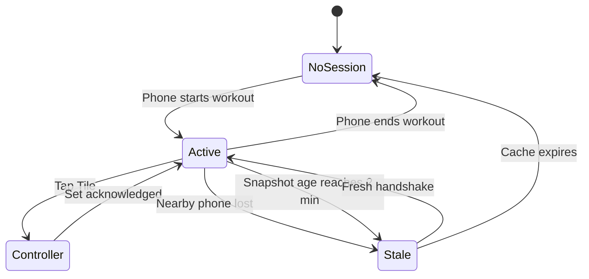

# Wear OS Phase 1 — active-workout Tile and current-set controller

**Status:** specification only — implementation is not authorized by this
document. A separate explicit GO is required after the transport decision and
entry gates below are closed.

- **Decision date:** 2026-09-01
- **Specification base:** `dev` at
  `bbc650ca2acda43d7e0121bb4309d467284a40a1`
- **Delivery lane:** independent Android-only branch and PR to `dev`; never
  stack Wear work on a KMP migration branch.

This specification is authoritative for the first Workeeper watch increment.
It extends [product.md](../product.md) and consumes the already-shipped live
workout behavior in [live-workout.md](live-workout.md). It does not reopen the
phone live-workout design.

## 1. Decision and outcome

Phase 1 is **Tile + one watch screen**:

- the Tile is a glanceable status surface and entry point;
- tapping the Tile opens one minimal Wear OS activity;
- the activity edits the values of the deterministic current set and completes
  that set;
- the Android phone remains the authoritative and only durable workout store;
- the watch stores only an expiring, non-authoritative display cache;
- the implementation is native Android/Wear OS, not KMP and not a precursor to
  shared watch UI.

The outcome is that a user who has already started a workout on the phone can
leave the phone in a pocket, glance at the next set, adjust weight or reps, and
record it from the watch.

## 2. Scope

### 2.1 In scope

- Wear OS only, paired with the Android Workeeper phone app.
- Galaxy Watch Ultra (2024) as the physical acceptance device, plus one small
  round Wear emulator so the UI is not accidentally device-specific.
- Tile states for no active workout, active workout, disconnected/stale data,
  and temporary loading/error.
- One activity with:
  - training name and overall exercise progress;
  - current exercise name;
  - current set ordinal;
  - weight controls for weighted exercises;
  - reps controls;
  - one primary `Complete set` action;
  - success/error haptics and explicit in-flight feedback.
- An ongoing activity/notification while the watch controller represents an
  active workout.
- A versioned phone/watch request, response, and command protocol.
- Strict phone-side validation before any write.
- English and Russian resources.
- Light/dark and round-display accessibility verification.

### 2.2 Explicit non-goals

- Starting, finishing, cancelling, deleting, or renaming a session from the
  watch.
- Starting a new exercise, picking another exercise, changing exercise order,
  or editing a plan from the watch.
- Adding/removing set rows, skipping an exercise, changing set type, undoing a
  completed set, or editing an earlier set.
- A rest timer, interval timer, or timer controls. The existing session elapsed
  time may be shown only if it does not require frequent Tile refreshes.
- Heart rate, calories, GPS, steps, motion sensors, automatic rep counting,
  Health Services, Health Connect, or Samsung Health.
- A standalone watch database or standalone workout mode.
- Phone UI redesign or behavior changes unrelated to the bridge.
- watchOS, iPhone pairing, SwiftUI, shared KMP watch presentation, or a common
  watch navigation model.
- Inline mutation controls on the Tile.
- Cloud sync, accounts, telemetry, or workout data in logs/crash metadata.

## 3. User and state flow



The watch never invents an active session. Every active state comes from a
phone response. A cached active state is visibly stale once its freshness
window expires and cannot authorize a write.

### 3.1 Tile contract

| State | Required content | Tap behavior |
| --- | --- | --- |
| No active session | Workeeper + `Start a workout on your phone` | Opens the local instruction screen; it does not remotely start the phone app or a session |
| Active and fresh | Training name, current exercise, set ordinal, compact overall progress | Opens the current-set controller |
| Active but stale/disconnected | Last known training/exercise plus `Phone unavailable` | Opens the controller in read-only reconnecting state |
| Loading with no cache | Workeeper + short loading label | Opens the reconnecting screen |
| Protocol/error | Safe generic error; no payload details | Opens recovery state with retry |

The whole useful Tile container is one large target. The Tile contains no
weight/reps steppers and no completion action. It renders the local cache
immediately and never waits for phone I/O. A refresh request may be launched
after rendering; a later response updates the cache and asks the system to
refresh the Tile.

Tile content is intentionally bounded because Tiles are non-scrollable,
glanceable surfaces. Updates must not be driven once per second. The Tile may
request a refresh on entry, after a command acknowledgement, after a connection
change, and through the platform's normal update budget; no polling loop is
allowed.

### 3.2 Controller contract

The activity has one scrollable screen and no nested navigation. Reading order:

1. connection/status label;
2. training and overall progress;
3. current exercise and `Set X of Y`;
4. weight stepper when the exercise is weighted;
5. reps stepper;
6. primary `Complete set` button.

Every interactive target is at least `48dp × 48dp`, with enough separation that
targets do not overlap. Controls have semantic labels that include the field,
current value, and action. Rotary input may be added only as a second input path;
all actions must remain reachable by touch.

The initial weight and reps exactly mirror the phone snapshot. Reps change in
steps of one. The weight increment is **not guessed in Phase 1**: the entry probe
must first inventory current phone validation and decide one explicit increment
that round-trips through the existing `Double?` model without hidden rounding.
Failure to close this choice before UI implementation is a STOP.

`Complete set` is enabled only when:

- the phone node has completed a fresh handshake;
- the snapshot is not stale;
- no command is in flight;
- reps are greater than zero; and
- the target identifiers still describe the current set locally.

Mutation freshness is exactly **two minutes**, measured from the watch's
monotonic receive time for the latest complete `ActiveWorkoutSnapshot`. Node
connectivity, wall-clock changes, retry timers, and non-snapshot traffic do not
refresh this deadline. At `120_000ms` the active state becomes stale even when
the phone node still appears connected, every mutation control is disabled,
and `Complete set` cannot enqueue a command. A complete replacement snapshot
resets the deadline. The foreground controller may issue one
`GetActiveWorkout` request when the deadline expires, and explicit retry may
issue another; neither the controller nor the Tile runs a background polling
loop.

The UI is pessimistic: it does not advance on tap. It shows in-flight feedback,
waits for a phone acknowledgement issued after the database write, then replaces
the screen from the returned snapshot. Success produces a confirmation haptic.
Timeout or rejection leaves the edited values visible, produces an error haptic,
and offers an explicit retry.

## 4. Canonical current-set rule

Phase 1 does not synchronize the phone screen's ephemeral expanded-card or focus
state. `LiveWorkoutStore.activeExerciseUuids`, draft text, and keyboard focus are
presentation state and are not durable truth.

The phone bridge derives the watch target from persisted rows:

1. order performed exercises by `position`;
2. ignore skipped exercises;
3. for each exercise, resolve visible set positions using the same
   `performed > plan > fallback` rule as Live workout;
4. choose the first position without a persisted completed set;
5. the first exercise with such a position is the watch current exercise;
6. if no target remains, return `Workout complete on phone` and disable writes.

This deliberately means out-of-order exercise selection on the phone is not
mirrored in Phase 1. It is safer than persisting a new pointer or treating an
ephemeral UI selection as session truth. Shared behavior-vector tests must run
the phone Live-workout completion rule and the bridge rule over the same planned,
performed, skipped, empty, and sparse-position fixtures. A mismatch is a STOP.

Drafts typed on the phone but not checked are not synchronized. This preserves
the existing explicit persistence contract: only a completed set is durable.

## 5. Ownership and consistency

### 5.1 Source of truth

- The phone Room database is authoritative.
- The watch never writes a workout database and never declares success before a
  phone acknowledgement.
- Watch storage contains only the last protocol snapshot, its receive time, and
  minimal connection metadata in app-private storage.
- A no-session response erases the active cache immediately.
- The two-minute mutation deadline is independent of display-cache retention:
  stale content may remain visible and read-only while mutation is disabled.
- After watch reboot or any loss of the monotonic receive-time baseline, a
  cached active snapshot starts stale and requires a fresh phone response.
- Cached workout content expires and is erased after 24 hours even if no phone
  response arrives.
- The Wear application opts out of Android backup/data extraction for this
  cache.

### 5.2 Command validation

Every completion command carries at least:

- `schemaVersion`;
- `commandId`;
- `sessionUuid`;
- `performedExerciseUuid`;
- `setPosition`;
- the snapshot revision/hash it was edited from;
- `weight`, `reps`, and immutable set type copied from the snapshot.

The phone accepts it only when the active session still matches, the performed
exercise belongs to that session and is not skipped, the position is still the
canonical current target, the revision is current, and values satisfy existing
domain validation. It writes through the existing set upsert behavior. The
`(performedExerciseUuid, position)` target makes a same-command retry idempotent.
If the acknowledgement was lost after a successful write, an exact existing
row/value match is acknowledged as already applied and returns the newer
snapshot; a differing row is rejected as stale.

The response echoes `commandId` and returns either a typed rejection or the
complete replacement snapshot. Free-form exception messages and stack traces
never cross the device boundary.

### 5.3 Races

- If the set was completed on the phone first, the watch command is rejected as
  stale and receives the newer snapshot.
- If the phone finishes/cancels the session, the watch clears to no-session.
- If connection drops before acknowledgement, the watch does not claim success;
  retry is safe.
- If the phone process restarts, a request rebuilds a fresh snapshot; the watch
  cache never becomes authoritative.
- Phone-side reads/writes from the listener must acquire the repository's
  generation-bound DB-work admission at first operation and release it in
  `finally`. The listener must not retain an `AppGraph` or repository across a
  backup restore/recovery generation swap. The existing backup-specific lease
  seam must be generalized or paralleled with a typed Wear seam before the
  listener touches the database.

## 6. Transport and privacy gate

This section is blocking, not advisory.

Workeeper currently promises that data does not leave the device and that there
is no cloud sync. Wear OS Data Layer is the supported phone/watch communication
API, but Android's documentation states that Data Layer clients can route data
through Google-owned servers when Bluetooth is unavailable. The payload is
end-to-end encrypted, but relay transit still conflicts with a strict
device-local promise.

`Node.isNearby` means a direct Bluetooth connection is possible; it is not, by
itself, documented as a per-message transport lock. Therefore an implementation
must not present `isNearby` filtering as proof that a payload could never use a
network relay.

Before production payload code, the owner must explicitly choose one of these
policies:

| Policy | Result |
| --- | --- |
| Preserve strict local-only guarantee | Implementation remains stopped unless a supported API can guarantee direct local transport for each workout payload |
| Permit end-to-end encrypted Data Layer relay | Amend `product.md` and user-facing privacy copy first; use the smallest non-persistent protocol and document that Google relay transit can occur |

Until that decision, only a payload-free capability/connectivity probe is
authorized by a future implementation GO. No workout name, exercise name, UUID,
set, weight, reps, or timing data may be sent during the probe.

If relay is explicitly accepted later, prefer `MessageClient` request/response
semantics over `DataClient`: messages are non-persistent and have no automatic
retry, while data items persist and may be backed up. The application must add
its own acknowledgement and safe retry semantics described above. Phone and
watch artifacts must use matching application IDs and signatures.

## 7. Android-only module boundary

Target topology for implementation:

```text
core/wear-protocol       Kotlin/JVM wire models + codec; no UI and no KMP target
feature/wear-bridge      Android phone listener, snapshot builder, validation
app/wear                 Wear OS application, Tile, activity, cache, transport
```

Constraints:

- `app/wear` uses Wear Compose/Material and Tiles ProtoLayout directly. It does
  not depend on `app/common`, phone navigation, `core/ui/kit`, or a shared KMP UI
  module.
- `feature/wear-bridge` may consume the Android target of existing data modules,
  but must not move Wear concepts into `commonMain`.
- `core/wear-protocol` is shared only between the two Android artifacts. A
  future watchOS protocol may be designed independently.
- No existing database schema change is expected.
- The watch application needs a narrow application convention without Firebase,
  Google Services JSON, Crashlytics, performance monitoring, or KSP.
- `app/wear` emits dev/store variants whose application IDs and signing keys
  exactly match the corresponding phone APK (`.dev` for development and the
  base package for store release). It declares the watch hardware feature and
  uses the repository SDK/version catalog.

The implementation entry probe must prove the final Gradle variant names,
paired-install package/signature equality, and that root `assembleDebug`,
`assembleDebugAndroidTest`, `lintDebug`, and `testDebugUnitTest` still discover
the intended Wear tasks. Failure is a STOP; do not weaken repository gates.

## 8. Lifecycle and ongoing surface

An active workout represented on the watch is a long-running experience. The
watch app must expose the platform ongoing-activity/notification affordance so
the user can return in one tap. It does not imply sensor tracking or a second
workout engine.

- Start it only after a fresh active-session response.
- Update it from cached snapshots, not a per-second loop.
- Deep-link it to the same controller activity.
- When the connection is lost, retain read-only status during the bounded
  reconnect window, then stop the ongoing surface and leave the stale Tile.
- Stop immediately on a no-session response.
- Never hold a wake lock solely to keep the Tile or controller fresh.

The exact reconnect window is fixed at implementation entry after measuring the
platform reconnect behavior on the target physical watch; it must be at least
the documented four-minute reconnection interval plus a small deterministic
margin, and must have a testable constant rather than an unbounded timer.

## 9. Protocol surface

The initial protocol has three logical operations:

| Operation | Direction | Purpose |
| --- | --- | --- |
| `GetActiveWorkout` | Watch → phone | Request the current authoritative snapshot |
| `ActiveWorkoutSnapshot` | Phone → watch | Replace cached state, including no-session |
| `CompleteCurrentSet` | Watch → phone | Validate and upsert the exact current set; respond with rejection or replacement snapshot |

All envelopes carry `schemaVersion` and a correlation ID. Unknown versions and
unknown operations fail closed. Payloads are bounded well below the Data Layer
message limit, use one deterministic `kotlinx.serialization` representation,
and have round-trip tests with committed fixtures. Protocol fields are domain
values, not localized strings, except display names that the watch must render.

There is no silent compatibility fallback. A newer incompatible peer shows an
update-required state and disables mutation.

## 10. Accessibility and product writing

- Minimum touch target: `48dp × 48dp`.
- Do not rely on color or haptics alone for success, failure, connection, or
  disabled state.
- Dynamic values use tabular numerals where available and remain legible with
  system font scaling.
- Long training/exercise names truncate predictably without hiding set controls.
- English and Russian strings use the repository localization conventions; no
  user-facing string is assembled from English fragments.
- Weightless exercises omit weight controls entirely.
- `Complete set` is the single visually dominant action.
- Destructive session actions do not appear anywhere on the watch.

## 11. Test contract

### 11.1 Host tests

- Protocol round trips, unknown-version rejection, size bound, and committed
  fixture compatibility.
- Watch state reducer for every Tile/controller state, including fake-clock
  proofs that a connected-but-silent snapshot is fresh at `119_999ms`, stale at
  `120_000ms`, and stale after reboot until a replacement snapshot arrives;
  connection changes, in-flight behavior, acknowledgement, retry, and error.
- Current-target derivation for planned, ad-hoc, skipped, complete, empty,
  sparse-position, weighted, and weightless sessions.
- Shared behavior-vector parity against the phone Live-workout done rule.
- Phone command validation for wrong session, wrong exercise, stale revision,
  stale position, invalid values, duplicate retry, write failure, and success.
- Cache expiry/erase and backup exclusion configuration.
- DB-work lease tests proving a listener cannot touch a retired generation and
  releases admission on success, failure, timeout, and cancellation.
- Tile layout tests proving one launch target and no mutation action.
- Accessibility semantics for every control and disabled/error state.

### 11.2 Device tests

- Paired physical Galaxy Watch Ultra + Android phone: install identity,
  capability discovery, request/response, complete set, haptics, phone DB result,
  Tile refresh, ongoing return affordance, disconnect/reconnect, phone-process
  death, and session finish on phone.
- Small round Wear emulator: clipped text, scroll reachability, `48dp` targets,
  font scaling, English/Russian, light/dark, weighted/weightless.
- Race: complete the same set on phone and watch; exactly one final row exists and
  the watch converges to the phone snapshot.
- Backup restore/recovery while a watch request waits or runs; no old-generation
  read/write survives.

Device evidence must identify the APK package/signature pair, OS/API versions,
and exact test scenario. Manual observation without the resulting phone DB
assertion is not completion evidence.

### 11.3 Repository gates

Run the full `AGENTS.md` gates for the final implementation diff, including:

- `assembleDebug`;
- `assembleDebugAndroidTest`;
- `verifyPaparazziDebug`;
- `:lint-rules:test`;
- `detekt`;
- the personal-data gate;
- `lintDebug`; and
- `testDebugUnitTest`.

Add focused Wear assemble, lint, unit, and instrumented-APK tasks once the exact
variant names are proven. A watch UI change also requires fresh rendered evidence
for the target round sizes; do not approve it from phone previews.

## 12. Parallel delivery with KMP migration

The streams are conceptually independent but share repository integration files.

- The specification PR changes only this new file and `product.md`.
- Wear implementation starts from the latest `dev` on its own branch, never from
  a KMP PR head.
- Watch UI and wire protocol remain Android/JVM-only and can be developed without
  modifying current KMP source sets.
- Plan-editor KMP integration PR #273 has landed in `dev` at merge commit
  `bbc650ca2acda43d7e0121bb4309d467284a40a1`; broader KMP migration continues.
  The phone bridge must extend that post-#273 `AppGraph` and `app/common` shape,
  then rebase onto the latest `dev` immediately before changing the graph or
  listener integration files.
- Any conflict is resolved by preserving the KMP architecture first and adding a
  narrow Android extension; never copy the pre-migration graph shape back.
- The Wear PR targets `dev`, remains separately reviewable, and cannot merge
  until the KMP-required contexts and Wear gates are green at the same final
  head.

## 13. Implementation increments after GO

1. **Entry probes:** package/signature variants, payload-free Data Layer
   capability probe, current-set parity fixtures, and Gradle task discovery.
2. **Protocol/cache:** versioned models, codec, watch cache, reducer, and tests.
3. **Watch read-only surface:** Tile, controller states, accessibility, and
   rendered evidence against fake transport.
4. **Phone bridge:** generation-safe snapshot reads and validated command write,
   rebased onto the latest `dev` and extending the post-#273 graph contract.
5. **Paired integration:** acknowledgement, Tile refresh, ongoing activity,
   disconnect/race handling, and physical-device proof.
6. **Final review:** full repository gates, signed commits, zero unresolved
   review threads, and an independent Codex review pass before handoff.

Each increment must remain buildable and reviewable. The privacy policy decision
must close before increment 2 sends any workout payload.

## 14. STOP conditions

Stop and return to the owner if any of the following occurs:

- no supported transport can meet the selected privacy policy;
- implementation would silently permit Google relay transit under the current
  strict product promise;
- phone and watch package names or signing certificates do not match;
- current-set behavior diverges from the persisted phone Live-workout rule;
- a watch command needs a new database source of truth or schema migration;
- a listener would access repositories without generation-bound admission;
- KMP/common source sets, shared watch UI, Health APIs, or sensor permissions
  become necessary;
- the Tile needs frequent polling or direct mutation controls to feel usable;
- root CI no longer discovers or validates the new modules;
- physical-device evidence cannot prove the resulting phone database state; or
- the branch is not rebased on the latest `dev` before touching overlapping KMP
  graph integration files.

## 15. Exit criteria

Phase 1 is complete only when:

- all defined Tile states and the single controller screen match this contract;
- a paired watch can update and complete the authoritative current phone set;
- stale/disconnected/protocol-mismatch states cannot mutate data;
- retry and phone/watch races converge without duplicate rows or false success;
- package/signature, lifecycle, cache erasure, accessibility, localization, and
  ongoing-activity requirements are proven;
- the chosen transport policy is reflected consistently in product/privacy copy;
- no Health, sensor, watchOS, or KMP watch scope entered the diff;
- all focused, repository, and paired-device gates are green at the final head;
- commits are signed and GitHub-verified; and
- the PR is handed to the owner for merge and is not merged by the implementer.

## 16. Platform references

- [Tiles overview and principles](https://developer.android.com/training/wearables/tiles)
- [Tile interactions](https://developer.android.com/training/wearables/tiles/interactions)
- [Ongoing activities](https://developer.android.com/training/wearables/notifications/ongoing-activity)
- [Wear Data Layer overview and transport behavior](https://developer.android.com/training/wearables/data/overview)
- [Reachable and nearby nodes](https://developer.android.com/training/wearables/data/discover-devices)
- [Data Layer client types](https://developer.android.com/training/wearables/data/client-types)
