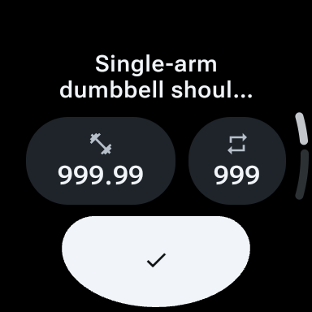
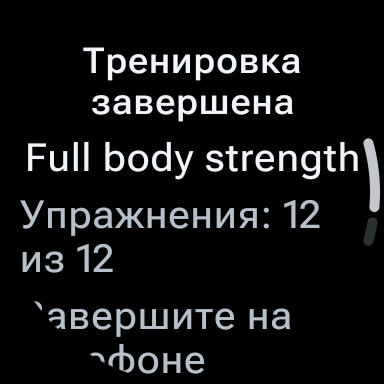
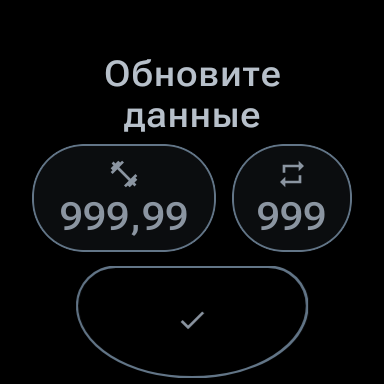

# Wear emulator acceptance — 25 September 2026

**Application readiness: FAIL.** Completion/informational geometry and the actual system Tile have confirmed defects. All **72 selected subject rows are recorded: 56 PASS, 16 FAIL, none missing**. These are evidence-row results, not 16 independent application defects. Successful controller and lifecycle observations do not waive the defects. The report compares immutable attempts; it does not merge or rewrite their canonical cohorts.

Final evidence snapshot: `2026-09-25T20:43:53.723912+00:00`. Earlier drafts and attempts are retained unchanged. No final PASS or physical-watch acceptance is claimed.

## Tested source and build types

The acceptance APKs belong to frozen source `85ae0cfee2e0ca198caf70c2e4dec6b89a5a691c` (PR #291), with application `src/main` identical to PR #290 `48e4688618702edd222696b8c2363a7c3a970129`. Builds ran before commit 85ae while HEAD was bcb8466; the archived commit binding verifies all built source bytes equal the committed 85ae tree. This is source-byte provenance, not a claim that rebuilding produces bit-identical APKs.

| Artifact | SHA-256 | Scope |
| --- | --- | --- |
| DevDebug | `8722c74d483fd50eeac03eba0f37a09b57c41b77dc8326f3d8ccf2950044d3a7` | Full matrix and synthetic lifecycle |
| DevDebug instrumentation | `264e1cc6d63f2413a06d1e8927cb2aef545bb924f92a24908b0e52b731944b53` | Actual MainActivity/device assertions |
| StoreDebug | `2d8463b2d60ddf982923fba2d4b671be8dfefbbd3fa1a0a293d80c37e6c2f6d7` | Fixed smoke subset, not full matrix |
| StoreDebug instrumentation | `37cc505a9062709b19fc571b4b9f4c7be047e418c0b2d78d90a27835f9dd77ac` | Fixed smoke instrumentation |
| StoreRelease | `669d8d7c079bb36ce14048a0a8948b84846698e8539e37ac4df85a8109c299e6` | Installed read-only/privacy boundary |

The later follow-up contains only acceptance infrastructure and documentation changes: durable API 30 locale setup, complete manual-artifact preflight, and explicit guarded API 30 SIGTERM selection. Those edits are not inside the tested APKs and cannot be retroactively attributed to the 85ae cohort. The separate v3 infrastructure receipt records 62 baseline tests, 34 intended named assertion controls and 62 restored tests; every command reports `5 actionable tasks: 5 executed`, with source bytes restored. The earlier v2 campaign’s incidental `InvalidEvidence` remains preserved and receives no full-campaign green credit. These Python checks do not rebuild or replace the original APK evidence. The final pre-commit audit confirms the 49 older recipe objects are unchanged and all 34 new controls match the executed v3 set; it does not claim all 83 controls were re-executed together. No application fix is included.

## Emulator system-image provenance

| Profile | Package | Previously verified system.img SHA-256 |
| --- | --- | --- |
| API 30 | `system-images;android-30;android-wear;arm64-v8a` | `c57d3ee411ffd159763e72d335d8b042bae71cbc8ff5e39913f8019fdf8a93df` |
| API 36 | `system-images;android-36;android-wear-signed;arm64-v8a` | `1bf97344d3cb60ec59c2fd184e84b52895efc67d94dba91d1b0c333de74af0cb` |

Actual fingerprints:

- API 30: `google/sdk_gwear_arm64/emulator_arm64:11/RWDA.230114.008.S4/10486519:userdebug/dev-keys`
- API 36: `google/sdk_gwear_arm64/emu64a:16/BP2A.250605.006.E4/13659021:user/release-keys`

[System-image provenance](system-image-provenance.json) retains source-properties, vendor, ramdisk and kernel hashes as well as raw fingerprint references. These are archived measurements, not a fresh multi-gigabyte hash sweep during passive trials.

## Recomputed matrix results

The required matrix is API 30/API 36 × 192/240 dp × EN/RU × font scale 1.0/1.24. Across the 16 configuration-qualified cells:

- **288 fixture/configuration pairs: 275 PASS, 13 FAIL.** Each cell contains 14 synthetic-runtime fixtures and 4 declared static previews. A preview result does not prove mutation authority.
- **352 invocations: 339 PASS, 13 FAIL**, including 16 rotary/editor/press flows and 48 short ambient journeys, all of which passed their automatic checks.
- **16 reviewed visual rows: 9 PASS, 7 FAIL** — 4 failures on API 36 and 3 on API 30.

The first two API 30/240 RU attempts actually ran with English locale. Their 36 fixture pairs (44 total invocations) are excluded from requested-RU coverage, with original FAIL/BLOCKED records retained. Correctly configured retries live in a second immutable cohort. The following selection is a report comparison, not a new canonical merged result.

| Cell | Configuration-qualified cohort | Automatic PASS/FAIL invocations | Manual visual | Automatic failed fixtures |
| --- | --- | --- | --- | --- |
| api30-192-en-1.00 | main | 22/0 | PASS | — |
| api30-192-en-1.24 | main | 19/3 | FAIL | anonymous_complete, complete, retryable |
| api30-192-ru-1.00 | main | 20/2 | FAIL | anonymous_complete, complete |
| api30-192-ru-1.24 | main | 22/0 | FAIL | — |
| api30-240-en-1.00 | main | 22/0 | PASS | — |
| api30-240-en-1.24 | main | 22/0 | PASS | — |
| api30-240-ru-1.00 | api30-locale-retry | 22/0 | PASS | — |
| api30-240-ru-1.24 | api30-locale-retry | 20/2 | PASS | anonymous_complete, complete |
| api36-192-en-1.00 | main | 22/0 | PASS | — |
| api36-192-en-1.24 | main | 19/3 | FAIL | anonymous_complete, complete, retryable |
| api36-192-ru-1.00 | main | 19/3 | FAIL | anonymous_complete, complete, retryable |
| api36-192-ru-1.24 | main | 22/0 | FAIL | — |
| api36-240-en-1.00 | main | 22/0 | PASS | — |
| api36-240-en-1.24 | main | 22/0 | PASS | — |
| api36-240-ru-1.00 | main | 22/0 | PASS | — |
| api36-240-ru-1.24 | main | 22/0 | FAIL | — |

Automatic failures and visual failures differ. In API 30/240 RU 1.24, the two conservative text-rectangle checks fail while the reviewed actual glyphs remain visible; the raw FAILs stand. Conversely, several automatically green cells visibly clip the additional finish instruction. No threshold was weakened to convert either result.

## Confirmed application defects

1. **Completion/informational content does not fit the accepted round-screen contract.** Both 192 dp EN 1.24 cells and the RU cases above show lost or partially attenuated glyphs. RU 192/font1.24 still clips the finish instruction after the actual maximum 38 px scroll. API 36/240 RU 1.24 also loses part of the instruction with no scroll range. Initial controller weight, reps and action remained visible; the failures concern completion/informational content. Retry text-rectangle failures retain separate pixel analyses: do not equate every geometric rectangle failure with demonstrated glyph loss.
2. **The actual system Tile stays stale after accepted refresh/reentry.** Reproduced independently on API 36 and API 30. On API 30, cache age 52,477–53,297 ms remains inside a 119,996 ms window and the Activity is ACTIVE, while the Tile still announces Refresh required. Its full accessibility phrase is present but only «Требуется» is drawn. A real Tile tap successfully returns to the same ActivityRecord/task; that positive result does not repair freshness or visibility. Missing update requests are a source-based hypothesis, not a traced callback/root-cause proof.
3. **StoreDebug parity keeps the shared geometry failure.** Both APIs’ fixed nine-invocation StoreDebug smoke subsets pass automatic checks; their separately audited event and draft-restoration flows also succeed. Both manual parity rows are FAIL because the required completion directive clips, as in DevDebug; no new Store-specific failure is inferred.

The geometry ledger, original/native screenshots, failed assertions, accessibility/bounds and actual maximum-scroll video frames remain authoritative. Application fixes must be separate from the evidence/infrastructure follow-up, followed by a new source freeze and targeted negative controls plus fresh acceptance.

The expected content follows the canonical [Phase 1 §3.1 Tile contract](https://github.com/stslex/Workeeper/blob/85ae0cfee2e0ca198caf70c2e4dec6b89a5a691c/documentation/feature-specs/wear-phase-1-active-workout-tile.md#31-tile-contract): **Active and fresh** shows the training name, current exercise, set ordinal and compact overall progress. That section also requires a later response to update the cache and ask the system to refresh the Tile. The [lifecycle §1 owner contract](https://github.com/stslex/Workeeper/blob/85ae0cfee2e0ca198caf70c2e4dec6b89a5a691c/documentation/feature-specs/wear-lifecycle-ui.md#1-one-process-owner-and-the-release-boundary) gives Activity and Tile the same runtime factory/owner in debug; the recorded Activity therefore provides relevant fresh-state evidence, rather than a separate mock model. The observed stale Tile contradicts that required state/content. This comparison establishes no new numeric refresh SLA, does not trace the platform callback, and does not imply real phone transport or release mutation support.

See [minimal reproduction procedures](minimal-reproductions.md) for the frozen debug fixture routes and native Tile sequence.

## Lifecycle and manual observations

| Scope | Evidence recorded | Boundary / remaining work |
| --- | --- | --- |
| API 36 timed lifecycle | All 9 canonical timed receipts PASS: 3 retention, 3 fresh-death, 3 disconnected-death | Emulator only; measured removal intervals straddle the selected deadline and stay within watchdog; not exact physical stop latency |
| API 30 retention | 3 PASS; same Activity/process across each ten-minute window with acknowledged refreshes | No causal retention benefit proved: the no-session baseline also stayed in MainActivity |
| API 30 timed deaths | All 6 separately recorded TERM root receipts PASS: 3 fresh and 3 disconnected | Explicit default-disposition SIGTERM15, with process identity and observed absence; original SELinux-denied SIGKILL BLOCKED remains preserved. All six timing and six ordinary-reopen audits are linked below; no SIGKILL/LMK or physical-watch equivalence is claimed |
| Natural ambient expiry | Both editors on both APIs have automatic PASS receipts and separate original-video/text reviews | Editor closes at expiry, local unsent values remain in the same process; instrumentation-specific clock symptom is qualified separately |
| Ambient clock/capabilities | Separate non-instrumented manual updates observed on both APIs; low-bit=false/burn-in=false reported by system | Instrumented editor videos' stale-minute symptom remains preserved; cause unisolated. Unsupported true-capability paths N/A on emulator, physical validation open |
| Notification denial | API 36 PASS; API 30 video-complete retry PASS is selected, with its original incomplete-video PASS retained separately | API 30 has no runtime POST_NOTIFICATIONS permission subcheck. Permission restoration alone does not repost; accepted fresh response does |
| Return/exit | Real ongoing affordance returns to prior editor; deliberate HOME exit allowed on both APIs | Same ActivityRecord/task/PID observed, not independently inspected Java object identity |
| Cache/draft restart | Both APIs restore canonical 999 read-only after unsent 998/process death; API 30 has six audited post-expiry ordinary reopens plus a separate unsent-draft trial | Original failed API 36 capture and later supplement remain separate. API 30 manual process restoration is registered PASS |
| Installed release | API 36 StoreRelease remains read-only connecting; debug fixture ignored and AcceptanceScenarioReceiver absent | ProfileInstaller DUMP receiver remains valid. run-as denial is unavailable inspection, not proof of missing cache. API 30 installed StoreRelease boundary is also registered PASS; process-birth visibility is unavailable on release |
| API 30 manual scope | Ambient, return, baseline, disconnect, notification, process restoration and release registered PASS; actual system Tile and StoreDebug parity registered FAIL | The StoreDebug failure is shared completion geometry despite its nine automatic smoke invocations passing |

### API 30 death timing and restart corroboration

The [six-trial audit summary](api30-term-receipt-summary.json) pins all 12 independent timing/reopen audits. The table gives observed removal intervals relative to the selected absolute deadline; each interval incorporates the conservative 10 ms clock precision. Every interval straddles the deadline, so the exact event side and exact stop latency are unknown. Maximum observed sample-start gap was 340 ms; maximum command duration was 208.524 ms. Each disconnected trial contains one disconnect, not a repeated-disconnect device proof.

| Trial | Selected deadline (elapsed ms) | Relative removal interval (ms) | New ordinary-reopen PID |
| --- | --- | --- | --- |
| death-fresh/1 | 8710897 | [-17, +263] | 20760 |
| death-fresh/2 | 9087985 | [-215, +135] | 12967 |
| death-fresh/3 | 9465165 | [-265, +135] | 6020 |
| death-disconnect/1 | 9723497 | [-227, +113] | 23428 |
| death-disconnect/2 | 9978871 | [-171, +139] | 7607 |
| death-disconnect/3 | 10236500 | [-140, +140] | 25094 |

All six ordinary no-extra MAIN/LAUNCHER reopens use a new process, preserve the canonical payload (999 reps / 999.99 kg), clear only the expired ongoing deadline, and expose three disabled controls with Refresh required. Their raw images, XML and cache framing are retained. An initial tool-render impression of black images was withdrawn after decoded-pixel/hash verification; it is not a capture failure or app defect.

The separate pre-expiry unsent-draft trial verifies canonical 999 → local unsent 998 → process death → new PID 23874 → canonical 999 read-only. Its 910-byte cache and absolute notification deadline 7,270,755 ms remain unchanged; a surviving notification is not renewed. The [independent process-restoration report](/private/tmp/wear-api30-process-restoration-review/report.md) retains its pre-registration recommendation status; the [subsequent canonical PASS receipt](/private/tmp/wear-acceptance-85ae0cfe-dev/cases/manual/api30/process-death-restoration/receipt.json) records the completed manual acceptance.

**Trial setup qualification.** Canonical `start_trial` first completes configuration calibration, then calls `fresh_setup` (`pm clear` for the explicitly isolated emulator Dev package) before launching/seeding the initial synthetic authority. The measured retention/death interval begins afterward. No clear, force-stop, reinstall or clock change is used inside that measured interval or as the death instrument. Standalone unsent-draft death/restoration does not clear data. This is not a claim that no data clearing occurs anywhere in setup; no production or user phone data is touched.

API 36 baseline observed a later SysUI transition; API 30 baseline retained MainActivity while Dozing for 600,030 ms without notification. These platform observations are reported separately. Neither calibrates production constants or substitutes for a physical watch.

## Executed local build checks and unresolved CI

Archived 85ae source-bound local gates:

| Gate | Exact Gradle summary | XML result |
| --- | --- | --- |
| Debug assemble + lint + unit | `2278 actionable tasks: 2278 executed` | 2809 tests / 372 suites; zero failures/errors/skips |
| Separate Detekt | `62 actionable tasks: 62 executed` | Completed |
| Instrumentation assemble + StoreRelease assemble | `2162 actionable tasks: 2162 executed` | Build gate; not device execution |
| DevRelease runtime/receiver boundary | `38 actionable tasks: 38 executed` | 2 tests; zero failures/errors/skips |

Commands include `--rerun-tasks --no-build-cache`; local memory-bounded execution flags are retained in command receipts. The later Python-only v3 infrastructure gate is separate evidence, not replacement evidence for these APKs.

**Remote CI remains unresolved: the fresh read at 19:37 UTC confirms PR #291 is open on 85ae, based on PR #290/48e, with Android FAILURE and iOS/Mockup SUCCESS.** The detailed failed-job archive was captured at 14:55 UTC. [PR #291, run 36145214305](https://github.com/stslex/Workeeper/actions/runs/36145214305), head 85ae, records `TrainingDaoPagedActiveWithStatsTest > pagedActiveWithStats returns trainings with exercise count and stats columns()` failing with `UncompletedCoroutinesError`, followed roughly 194 s later by runner shutdown. The unit step was cancelled and Android XML/release-boundary upload did not complete. Earlier failure identities pass in that run; source files are unchanged. Local passing XML does not resolve CI or establish its root cause.

The prior real-worker Wear RU diagnostic on [run 36107849096](https://github.com/stslex/Workeeper/actions/runs/36107849096) passed both DevDebug and StoreDebug targets with fresh XML/events. It did not reproduce the earlier timeout and does not explain it. Ordinary test/CI timeout policy has not been changed; no pure-infrastructure classification is asserted. This is the recorded 85ae remote snapshot; the infrastructure/report follow-up has not yet been pushed at this evidence cutoff and has no remote CI result here.

## Preserved invalid or incomplete attempts

- The first API 30 notification manual row was marked PASS without the required native video. Its receipt remains untouched and is excluded from sufficient final evidence. The separately recorded video-complete retry is selected instead.

- Initial bcb8466 matrix: 44 invocations / 4 FAIL, including automatic-ambient setup and an invalid overflow assumption. Its source-specific rendered report remains immutable; no result was promoted to 85ae.
- Initial API 30 RU 240 English-locale attempts and locale-reload race before EN 192 setup: retained with exact retry mapping. Durable locale preparation changes the instrument only; frozen source/APKs remain 85ae.
- API 30 SIGKILL denial remains BLOCKED. The guarded TERM instrument is a distinct separately completed attempt, with default disposition/process identity and observed death required; no silent fallback.
- Original post-death hierarchy capture returned only a dump message, and the first screenshot was ambient. Explicit-file XML and later interactive wake supplements are separately retained; no first-try PASS or initial unsent-draft proof is invented.
- Failed manual registration due empty streams and the EN 192 external guard's missing `bytes` field remain preserved. Corrected scripts write new outputs; they do not overwrite old attempts.
- Initial real-Tile picker/tap attempts, including a capture labeled opened-main that is actually SysUI/Dozing, receive no successful-return credit. Successful later native taps are linked separately.
- Failed diagnostic observer/classpath preparation and later successful instrumented CI runs remain distinct. Observer success is not a root-cause fix.

## Acceptance still open

The application result stays **FAIL** until geometry and Tile defects are fixed and verified. All required emulator observations are recorded; observation completion is distinct from application acceptance. Physical reconnect measurement, process-death notification removal, production policy calibration, Wear OS 5+/older-device behavior, and supported low-bit/burn-in behavior remain open. Privacy and transport gates remain closed: no real phone payload transfer, phone acknowledgement or end-to-end real workout is established. N10 phone ordering stays outside this UI change; no phone database change is claimed.

The final required-row comparison contains **56 PASS, 16 FAIL, 0 BLOCKED and 0 MISSING**. The historical SIGKILL BLOCKED is retained among original attempts and is superseded for the same required subject by the separately recorded TERM retry; it is not rewritten. These are row statuses, separate from the 352 individual invocations.

The 72-row structure comprises 16 UI rows, 18 timed lifecycle rows, 4 natural-expiry rows and 34 manual rows. `attempt-mapping.json` preserves each original attempt and the selected receipt hash across four immutable Dev cohorts. The 16 failed rows comprise five automatic UI rows, seven visual rows, two Tile rows and two StoreDebug parity rows. These overlap application defects. Its summaries do not mutate or replace canonical `report.json`, JUnit, HTML or raw instrumentation evidence.

Fresh canonical rendering remains separate: main is FAIL, locale retry is FAIL, and the intentionally partial Store, TERM and notification cohorts are BLOCKED overall. Their completed selected cases remain explicit; no merged canonical receipt or synthetic JUnit success is created. The final navigation index corroborates 288 configuration-qualified fixture pairs and the 36 excluded wrong-locale pairs.

## Original figures

The six PNGs in `images/` are byte-identical copies of original captures, with provenance in `selected-original-images.json`. They are byte-identical originals selected for this report; no image has been edited.

DevDebug API 36/192 EN 1.0: initial values and action fit.

DevDebug API 36/192 RU 1.24: missing finish-instruction text at initial view; maximum-scroll evidence is linked in the geometry report.

DevDebug API 30/192 EN 1.24: completion clipping; raw assertion retained.

DevDebug actual API 30 system Tile after fresh-cache reentry: stale and incomplete status.

StoreDebug API 36: ordinary restart restores canonical 999, not prior unsent 998; read-only.

Installed StoreRelease API 36: connecting/read-only boundary; synthetic controls unavailable.

## Evidence navigation

- [API 36 geometry ledger](/private/tmp/wear-emulator-acceptance-20260925/api36-geometry-defect-ledger.md)
- [API 30 RU 192 final visual findings](/private/tmp/wear-api30-192-ru-visual-review/final-summary.json)
- [API 30 RU 240 retry visual findings](/private/tmp/wear-api30-240-ru-retry-visual-review/summary.json)
- [Actual API 30 Tile review](/private/tmp/wear-api30-system-tile-review/report.md)
- [Actual API 36 Tile review](/private/tmp/wear-api36-system-tile-final-audit/report.md)
- [API 36 timed lifecycle audit](/private/tmp/wear-api36-lifecycle-consolidated-audit/summary.md)
- [API 30 lifecycle / original signal limitation](/private/tmp/wear-api30-lifecycle-stopped-audit/report.md)
- [API 30 final process-restoration audit](/private/tmp/wear-api30-process-restoration-review/report.md)
- [Final navigation index](/private/tmp/wear-acceptance-attempt-index-final-20260925/index.json)
- [Final main canonical render receipt](/private/tmp/wear-emulator-acceptance-20260925/final-canonical-report-renders/main-receipt.json)
- [Partial support-cohort render receipts](/private/tmp/wear-emulator-acceptance-20260925/final-canonical-report-renders/receipts.json)
- [Final source/APK binding](/private/tmp/wear-emulator-acceptance-20260925/final-build-review/commit-binding.json)
- [Fresh PR/check snapshot](/private/tmp/wear-pr291-live-before-final-20260925.json)
- [Archived CI diagnosis](/private/tmp/wear-emulator-acceptance-20260925/pr291-ci-20260925T145538Z/summary.json)

- [Machine-readable attempt mapping](attempt-mapping.json)
- [Source and gate pins](evidence-manifest.json)
- [Original image pins](selected-original-images.json)
- [API 30 TERM receipt summary](api30-term-receipt-summary.json)
- [Frozen application boundary proof](/private/tmp/wear-final-production-boundary-20260925.json)

The machine-readable manifest retains exact raw file paths and SHA-256 pins from the local evidence archive. Those absolute paths require the original archive and are not assumed to exist in a fresh repository checkout. The six checked-in figures and summary JSON are a review aid, not a replacement for raw video, instrumented output and command receipts. The repository runner documents how to collect a new independent cohort; no APK reproducibility claim is implied.
