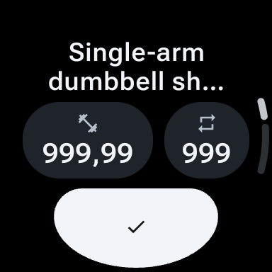
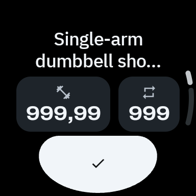
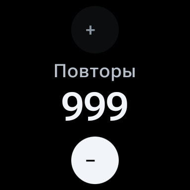
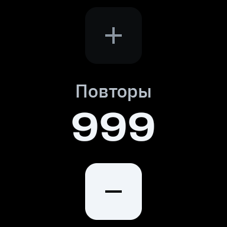
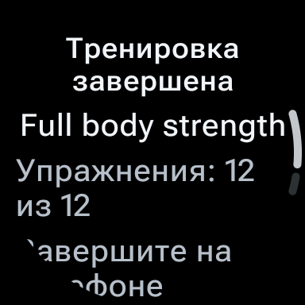
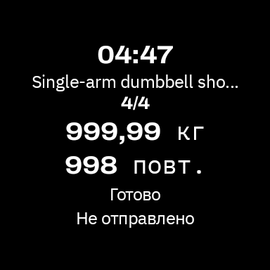

# Wear shared style, MVI and system acceptance

Shared Wear style, presentation MVI, relative rotary input, full phone Firebase integration,
system Tile refresh and the notification-settings correction are implemented. The corrected APK
passed the selected 16-cell UI matrix and six explicitly scoped platform subjects below.

This is a qualified emulator result: the three complete corrected-cohort inventories remain
BLOCKED because they do not contain every declared subject. The earlier source `5920e1ee`
cohort retains 69 PASS, 2 BLOCKED and 1 FAIL, with separately linked repetitions and the actual
Settings crash fixed here. September 25 acceptance does not verify these changes.

## Delivered changes

The stack is [#291](https://github.com/stslex/Workeeper/pull/291) → [#292](https://github.com/stslex/Workeeper/pull/292) →
[#293](https://github.com/stslex/Workeeper/pull/293) →
[#294](https://github.com/stslex/Workeeper/pull/294) →
[#295](https://github.com/stslex/Workeeper/pull/295). The PRs remain open for the owner to merge.

- Shared source for seven font assets and 37 colour tokens. Phone font roles and token values
  remain unchanged. Wear adapts IBM Plex Sans for words, Archivo for numbers and IBM Plex Mono
  for auxiliary roles, with its deliberate black background and round-screen geometry.
- Existing project Store/Handler/StoreProcessor presentation: editor and notice decisions live
  in handlers, formatting is cached by the mapper, and Compose retains scroll/focus mechanics.
  The process runtime retains cache, authority, ongoing activity and Tile ownership.
- Relative rotary batches apply each step to the current draft. Real pre-fix Kotlin regression
  reproduced the multi-step error. Vector signs are centered inside 48 dp touch targets.
  Completion text has a safe circular viewport and scrollable details.
- Full phone Firebase SDK set on Wear: Analytics, Crashlytics and Performance, using the
  corresponding phone Dev/Store Google Services configurations. Crashlytics gets `platform=phone`
  or `platform=watch` before graph initialization. Local API36 Crashlytics session metadata verifies `platform=watch`; report
  delivery to the Firebase console was not observed. This is not a global Analytics/Performance
  attribute claim.
- Process-owned Tile invalidation follows persisted display, recovery and locale changes.
  Native Tile observations on both APIs show active progress, disconnect and natural expiry.
  Immediate post-refresh native frames can retain the preceding state until the system updates.
  ProtoLayout uses supported system fonts and shared colour roles.
- The actual API30 notification button exposed an unsupported public per-app Settings action.
  The correction keeps that action where supported and falls back to public system Settings.
  If neither route exists, the existing UI-event boundary reports failure without terminating
  the controller or changing notification permission.

Protocol, database and WatchWorkoutReducer remain unchanged. Synchronous expiry before leaving
ambient is preserved. No second MVI library or real phone-payload transport was introduced.

## Corrected source and fresh checks

Application source: `6164203f3018cdfc091045c69d3aa0ff78423fde`. Gates executed on the pending
fix above source `5920e1ee`; all 2,488 tracked blobs were then verified byte-identical to the signed
commit. Only the two platform-dispatch production files changed after the source `5920e1ee` cohort;
256 selected runtime, UI, test and shared-resource files are unchanged. This establishes change
scope, not a rerun of the earlier long-duration observations.

| Fresh corrected-source check | Actual result |
| --- | --- |
| Restored Settings/notification tests | 11 tests; `106 actionable tasks: 106 executed` |
| Root debug build, lint, unit tests | 2,917 tests without failures/errors/skips; 77 lint reports without errors; `2360 actionable tasks: 2360 executed` |
| Repository-wide test APK build | Build only; `2169 actionable tasks: 2169 executed` |
| Signed StoreRelease and release-runtime guard | 1 test; `234 actionable tasks: 234 executed` |
| Separate Detekt | 55 reports without findings; `63 actionable tasks: 63 executed` |

All commands ran serially with `--rerun-tasks --no-build-cache --no-configuration-cache`.
The Settings failure first reproduced in two API30/33 Kotlin assertions. Named controls
`NOTIFICATION_SETTINGS_FALLBACK_REMOVED`, `NOTIFICATION_SETTINGS_APP_ROUTE_REPLACED` and
`NOTIFICATION_SETTINGS_UNAVAILABLE_CRASHES` each reached the intended assertion RED and
restored exact target bytes. Together with the earlier 61, there are 64 named witnesses;
this is not a claim that all 64 ran at source `6164203f`.

Frozen APK SHA-256 values:

| APK | SHA-256 |
| --- | --- |
| DevDebug | `db60947bc17a9dac7a4948a9fc6851492433aa33467267f41ddadab549cf4c06` |
| DevDebug test | `6bd05ef05dafb17fb5bb025347b27a4d072cfaf11c7df1838ba93f2fba6881c6` |
| StoreDebug | `d743fa011f2b66cb4f9d23244f226542fba366fb6305ae7f23ae5fcf82d00572` |
| StoreDebug test | `722d311c386bd6087de26fe1c4b5397677e5ba611dcbd0a4784e55eb3b25e712` |
| Signed StoreRelease | `3e222dbcb7dbc5a2dedd04e4492a4e9c611150f05ceb56fcbaec26ade08ca879` |

The [corrected scope index](proof/corrected616/notification-fix-closure/scope-index.json)
selects **16 PASS UI cells, 352 fresh instrumentation invocations**, with per-cell native/Compose
PNGs, semantics, measured bounds and sampled motion reviewed. Matrix: API 30/36 × round 192/240 dp
× EN/RU × font 1.0/1.24. Each cell contains 18 fixture invocations, rotary/Back/swipe/press checks
and three ambient/editor checks. Actual Activity configuration, source and installed APK hashes
bind every result.

The first corrected API 36/192 dp/EN/font 1.0 native visual attempt is still **BLOCKED**: six snapshots
showed the system Hello screen even though 22 Compose invocations passed. A separate complete
22-invocation repeat on identical source/APKs supplies the selected cell. Thus 374 invocations
were executed across those UI attempts, with 352 selected; the original receipt and images were
not replaced. A later API 36/240 dp preflight also showed Hello; the matrix was not entered until
native XML and a separately reviewed screenshot showed Workeeper after wake/Back/launch.
The overlay cause was not established and no system/app service was disabled to hide it.

Exact decoded RGBA equality reuses the prior pixel inspection only for identical images.
For the 16 selected cells, every differing image and every fresh sampled motion sheet was
inspected. Prior execution is
never relabelled. Fresh clock, press/disabled shading and capture differences remain recorded
without an invented cause. The named guards cover the centered signs, bundled font roles,
complete Russian completion wording after scroll and multiple relative steps in one rotary event.

All six corrected-source platform subjects passed: actual notification Settings/Back and
restoration, the declared nine-invocation StoreDebug subset with headless transitions, and signed
StoreRelease boundaries, on both APIs. StoreDebug's full UI inventory remains partial/BLOCKED;
its source `5920e1ee` draft-death observations were not rerun on source `6164203f`. Ordinary/debug-extra release
launches remained read-only Connecting and the debug acceptance receiver was absent.

The main Dev, Store and one-cell repeat inventories intentionally keep their aggregate BLOCKED
status. Only this cross-cohort index closes the listed corrected scope; it does not turn every
unexecuted inventory row green.

The corrected API30 native notification trial used the actual package toggle and verified
importance=NONE. The app's button opened public system Settings twice; Back returned the same
ActivityRecord/task and PID/birth. Native grant alone did not renew ongoing activity; a fresh
admitted event did, and terminal removed it. The original source `5920e1ee` crash remains FAIL.
One global AndroidRuntime-log oracle was INVALID because old GMS/system entries predated the
trial; before/after global logs were byte-identical and current-app PID logs were empty.
No global crash-free claim follows from that correction.

The corrected API36 trial recorded initial shell permission setup explicitly, then used two
actual system-dialog denials. Two actual app-button taps opened the per-app notification Settings
page. Back retained MainActivity `215440638`, task `929`, and PID `23284` (birth `116966`). The actual native
Off→On toggle granted notifications; grant/ordinary Back alone did not publish ongoing activity,
a fresh admitted event did, and terminal removed it. The denied fresh state preceded native
grant by about 7 seconds, inside the 120-second window. The empty current-PID runtime log remains
hash-linked; the registration helper's rejection of an empty standalone attachment and the
corrected registration are both retained.

## Native visual comparison

These are byte-for-byte original system PNGs, API 36/round 192 dp/RU/font 1.24, DevDebug.
The before column comes from the historical review APK; after comes from corrected source `6164203f`.
The [screenshot manifest](screens/manifest.json) keeps separate source/APK provenance.

| Surface | Historical review | Corrected APK |
| --- | --- | --- |
| Controller |  |  |
| Reps editor |  |  |
| Completion, initial viewport |  |  |

The complete lower instruction is reached by scrolling; it is not claimed to fit initially.

## Immutable source `5920e1ee` evidence

Application source: `5920e1eef3b4af649b00fb343ee5f50f642c58b3`. All gates below were executed
serially with `--rerun-tasks --no-build-cache --no-configuration-cache`; Detekt was separate.

| Check | Actual result |
| --- | --- |
| Tile baseline | 7 tests; `106 actionable tasks: 106 executed` |
| Root debug build, lint, unit tests | 2,905 tests, no failures/errors/skips; 77 lint reports without errors (plus one dependent Detekt report); `2360 actionable tasks: 2360 executed` |
| Restored Tile tests and repository-wide test APKs | 7 tests; `2181 actionable tasks: 2181 executed` |
| Signed StoreRelease and runtime boundary | 1 test; `234 actionable tasks: 234 executed` |
| Detekt | 55 reports without findings; `63 actionable tasks: 63 executed` |

Fifty host and eleven device negative controls have assertion RED witnesses and exact restored
mutation-target bytes. Seventeen ran again on source `5920e1ee`; the others retain their explicit
checkpoint provenance and matching target hashes. Compiler, setup, wrong-oracle and equivalent
mutations are INVALID, not RED. Foundation evidence separately contains 456 phone golden cases
across 40 suites and 1,845 total tests; these counts describe different things.

All 16 full UI cells passed and were visually reviewed: API 30/36 × round 192/240 dp × EN/RU ×
font 1.0/1.24, with 22 instrumentation invocations per cell. Primary values, main action and
blocking reason are visible initially. Long text and set details remain reachable after scroll;
the complete lower instruction is not claimed to fit initially. Back, swipe, rotary batching,
focus restoration, press behavior and ambient editor restoration are covered.

Native/Compose capture differences remain documented, including upper-edge scroll pixels,
pressed states, one dimmer native frame and two wider pixel differences with unchanged legible
geometry. Their capture causes were not established. Tool-preview omission of repeated regions
was checked against original pixels and is not classified as an application blank frame.
The original reported intraword break in “тренировки” was not located; the guards protect the
reproducible completion text and do not claim to reproduce that unidentified state.

### Original outcomes and qualified repeats

The original 72-row cohort closed collection with **69 PASS, 2 BLOCKED, 1 FAIL**.
It is not an all-green cohort. The linked cross-cohort index preserves three separate repeats:

| Original case | Recorded limitation | Separate observation on identical source/APKs |
| --- | --- | --- |
| API36 fresh process death #1 | Android started a Firebase transport job about 38 seconds after the old process died | Strict process absence under an explicitly offline emulator condition, with all Firebase SDKs and services enabled |
| API30 fresh process death #1 | Android started WorkoutTileService about 13 seconds after the old process died | Strict process absence offline after removing the installed native Tile through system UI; service and app remain enabled; Tile was then restored and independently tested |
| API30 retention #3 | Runner reported exactly 600,000ms/PASS; independent conservative audit credited only 599,990ms | New 600,060ms trial, conservative lower bound 600,050ms |

The qualified index contains 68 ordinary PASS rows, these three qualified repeats, and the real
notification FAIL. Default/unblocked SIGTERM established observed process death and absence;
these are not SIGKILL, LMK or physical-watch trials. All twelve strict death trials have raw
cadence/removal brackets and ordinary-launch restoration evidence. Cache payload and metadata
remain unchanged except removal of the expired eight-byte deadline. No ordinary reopen renews
ongoing activity or restores an unsent draft.

The no-session baseline and three active-retention trials ran for at least ten conservative
minutes per API after the documented API30 repeat. API36 baseline returned to SysUi in the
observed 71,010–72,140ms bracket; API30 baseline entered Dozing while retaining MainActivity.
Active trials retained their Activity/task and admitted ten synthetic refreshes. These are
specific emulator observations, not a universal OS timeout or shipping-performance claim.

Four real-clock expiry trials (reps and weight on both APIs) preserve draft values, close the
expired editor and disable stale controls on wake. Their instrumented displayed-minute behavior
is not used as proof of real minute updates. Independent manual ambient observations span over
90 seconds per API, with actual system ambient state and visible minute changes. Both images
report low-bit=false and burn-in=false: those capability branches are explicitly N/A.

Actual native ongoing affordances return the same Activity/task and unsent 998 editor on both
APIs. Separate short background-death trials reopen canonical 999 with disabled controls;
cache bytes and absolute deadlines remain identical across the short restoration sequence.

Native notification denial removes the ongoing key and leaves a reachable notice/button.
API36's actual permission dialog works. API30's actual button on source `5920e1ee` crashed with
`ActivityNotFoundException`; its log, dying/recreated PIDs and original FAIL are retained.
Native restoration alone does not publish ongoing activity; an admitted fresh state does.
Headless disconnect shortens the deadline, repeat does not extend it, and terminal removes it.
The ineffective API30 POST_NOTIFICATION app-op experiment is explicitly excluded as a denial
oracle; the accepted reproduction used the actual native app toggle and package importance=NONE.

StoreDebug passed its declared nine-invocation smoke subset on each API, plus headless state
transitions and draft restoration. Its full cohort remains partial/BLOCKED. Signed StoreRelease
was installed on both APIs; ordinary/debug-extra launches stayed read-only, the acceptance
receiver was absent and synthetic broadcasts were not acknowledged. Debug/test APKs were restored.
This is release-boundary evidence, not shipping-performance measurement.

## Preservation and remaining limits

About 32.3 GiB of old build output and unused Gradle transforms was removed with owner authorization.
The preservation manifests checked 6,969 retained files in the first checkouts and another 4,462
in the legacy checkout. The final ignored-intermediate cleanup preserved another 5,400 files
byte-for-byte and freed about 4.5 GiB. Sources, worktrees, user changes, AVDs and existing evidence
were retained.
Downloads, user AVDs and SDK contents were measured but not indiscriminately deleted. Later
build/cache growth means the removed total is not the current free-space value. A final
measurement on September 27 at 02:19 UTC found 8.1 GiB available.

Only synthetic/debug payloads were used. Real phone transport remains behind the privacy gate.
Physical watches, reconnect, energy and hardware ambient behavior remain outside emulator proof.
There is no measured shipping-performance claim. The causes of coroutine timeouts on #291 and
the first #294 CI run remain unestablished; a later unchanged #294 run passed.

Raw evidence remains under `/private/tmp/wear-style-mvi-evidence-20260926`. Curated, immutable
source/APK/gate/mutation/cohort indexes and original screenshots accompany this report.

## Evidence and GitHub status

- [Curated proof inventory and hashes](proof/manifest.json).
- [Archived XML publication paths](proof/xml-publication-paths.json): original XML bytes are kept
  outside CI current-test discovery paths; historical RED assertions are preserved.
- [Corrected-source gate sequence](proof/corrected616/notification-fix-gate-sequence.json),
  [APK manifest](proof/corrected616/notification-fix-apks/manifest.json) and
  [unchanged runtime boundary](proof/corrected616/notification-fix-unchanged-runtime-boundary.json).
- [Original source `5920e1ee` qualified index](proof/original592/final-acceptance-closure/qualified-index.json).
- [Corrected API30 Settings](proof/corrected616/notification-fix-api30-settings-reviewed/operator-review.json)
  and [API36 Settings](proof/corrected616/notification-fix-api36-settings-reviewed/operator-review.json).
- [Cleanup evidence index](proof/corrected616/cleanup-index.json) and
  [preserved checkout/prototype verification](proof/corrected616/final-publication-preservation.json).

At the linked [pre-publication GitHub snapshot](proof/corrected616/github-before-final-docs.json),
all executed checks on #292, #293, #294 and application commit `6164203f` in #295 were successful;
#291 still had its original Android failure. The causes of the #291 and first #294 timeouts
remain unestablished. The existing #295 bot review covers source `5920e1ee` only. Marking the final PR
ready requests a review of the final head; its subsequent result must be read live, not inferred
from that earlier review.

This publication adds documentation and evidence only. Application sources/APKs remain `6164203f`;
it does not claim new Gradle execution merely because the report has a later commit SHA.
